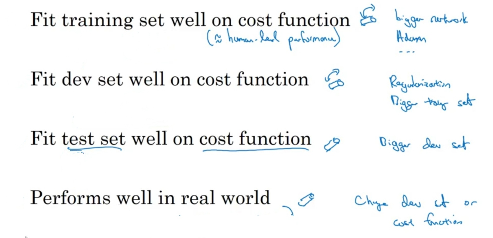

# Orthogonalization

## Description

برای بهبود عملکرد سیستم بسته به مشکل راه های مختلفی وجود داره که فقط رو یه جنبه از الگوریتم تاثیر میذاره و با جنبه های دیگه کاری نداره، اول لازمه طبق تصویر زیر مشکل سیستم رو تشخیص بدین:

در زیر تمامی حالات زیاد بودن error بین دو موقعیت رو با راه حلش میبینیم:

- بین human و training: یعنی سیستم high bias هست
- بین training و training-dev: یعنی سیستم high variance هست
- بین training-dev و dev: یعنی سیستم مشکل data mismatch داره
- بین dev و test: یعنی دیتای dev و test از یک فضای یکسان نیست

حالا بسته به تشخیص بالا تو دو تصویر زیر مشخص شده که برای هر مشکل سراغ چه راهی بریم:

- برای فیت شدن بهتر training set از bigger network و Adam استفاده میکنیم
- برای فیت شدن بهتر dev set از Regularization و bigger treating set استفاده میکنیم
- برای فیت شدن بهتر test set از bigger dev set استفاده میکنیم
- برای اجرای خوب روی دیتا های واقعی از change dev set یا change cost function استفاده میکنیم
