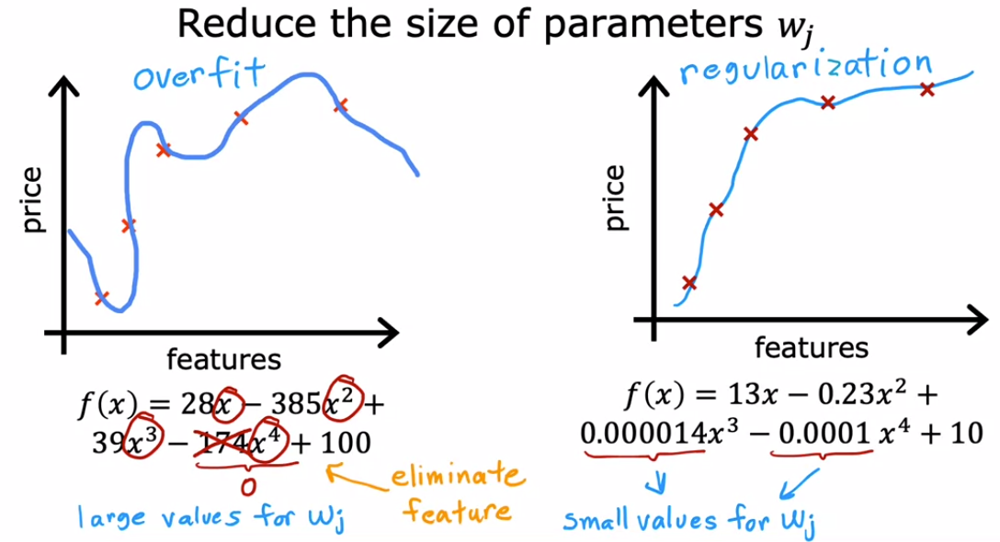
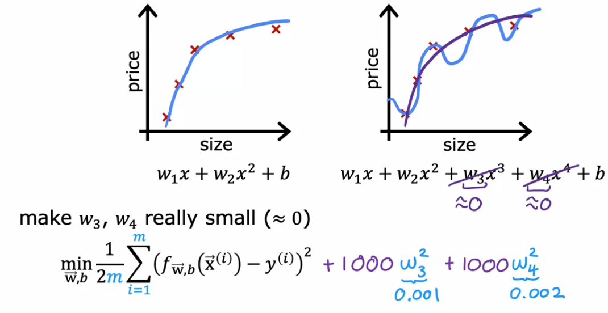
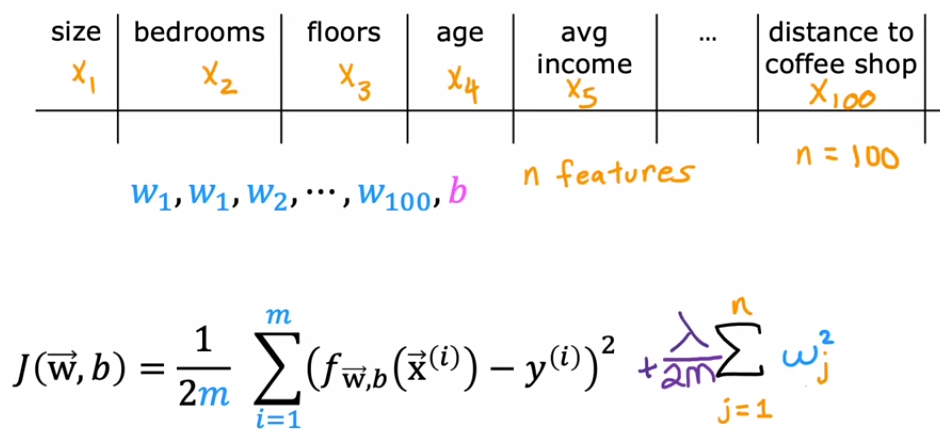

# Ridge (L2)

## Description

Ridge regression modifies ordinary least squares by adding a penalty term proportional to the square of the coefficients, controlled by $\lambda$ (or α). This reduces overfitting by shrinking coefficients toward zero, acting as implicit feature selection.

Tuning α via cross-validation balances complexity and accuracy. Ridge handles multicollinearity well, stabilizing coefficient estimates where OLS struggles.

## Formula

$$
J(\mathbf{\beta}) = \sum_{i=1}^{n} (y_i - \mathbf{x}_i^T \mathbf{\beta})^2 + \lambda \sum_{j=1}^{p} \beta_j^2
$$

- $y_i$ is the target value
- $\mathbf{x}_i$ is the feature vector
- $\mathbf{\beta}$ are the coefficients
- $\lambda$ controls regularization strength

## Workflow



<span dir="rtl">تو تصویر بالا نشون داده شده که با اعمال ضریب های (w) کوچک امتحان میکنیم که آیا حذف یک متغیر دارای توان به حل مشکل ما کمک میکند یا خیر، از آنجایی که مقادیر w و b را سیستم بطور اتوماتیک تعیین میکند و ما در آنها نقشی نداریم لذا با استفاده از روش زیر، سیستم را مجبور به انتخاب اعداد کوچک برای ضریب های (w) دلخواه خود میکنیم:</span>



<span dir="rtl"> در تصویر بالا ما تنها تاثیر دو متغیر w سه و w چهار را کم کردیم، اما در سیستم های پیچیده تر بجای این کار از الگوی زیر استفاده می شود:</span>



<span dir="rtl">در الگوی بالا n تعداد متغیر های (w) های حاضر در معادله هستش، با بالا بردن $\lambda$ سیستم مجبور به انتخاب w های کوچکتر می شود که دقیقا هدف ما از انجام Regularization هستش</span>

## Example

Ridge helps prevent overfitting in house price prediction. Given a dataset (e.g., bedrooms, lot size, year built, prices), Ridge applies L2 regularization, ensuring stable coefficients while fitting a linear model for price forecasting.

```python
from sklearn.linear_model import Ridge

# Train Ridge regression with L2 penalty
model = Ridge(alpha=1.0)
model.fit(X, y)
```
