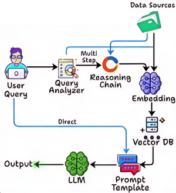

# Adaptive RAG [RAG]

## Description

Is an advanced framework that enhances language models by integrating dynamic retrieval and reasoning processes.
Unlike traditional RAG systems that use a fixed number of retrieval steps, Adaptive RAG intelligently determines how many retrieval and generation cycles are needed based on the complexity of the task.

This approach enables the model to efficiently handle multi-stage reasoning, adapt to diverse information needs, and provide more accurate and context-aware responses, making it especially effective for complex, multi-step workflows.

!!! info

    مناسب برای زنجیره‌های چندمرحله‌ای
