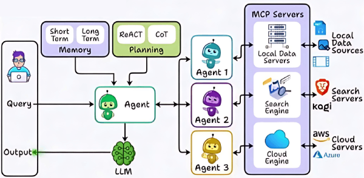

# Agentic RAG {RAG}

## Description

Is an advanced retrieval-augmented generation framework that empowers language models with agent-like capabilities.
Unlike standard RAG systems, Agentic RAG enables the model to autonomously plan, decide, and execute multiple retrieval and reasoning steps, adapting its strategy based on the evolving context and task requirements.
This approach allows for more flexible, interactive, and goal-driven workflows, making it highly effective for complex problem-solving and dynamic information gathering.
