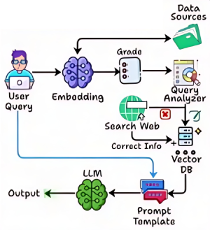

# Corrective RAG [RAG]

## Description

Is designed to refine and improve the outputs of language models by incorporating corrective feedback loops.
Unlike standard RAG systems that generate responses based solely on initial retrievals, Corrective RAG iteratively evaluates and adjusts its answers, leveraging additional retrievals or user feedback to address inaccuracies or incomplete information.

This approach enhances the reliability and precision of generated content, making it particularly suitable for scenarios where high accuracy and iterative improvement are essential.

!!! info

    مناسب جهت اصلاح و بهبود نتایج
