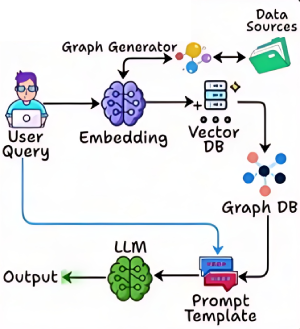

# Graph RAG [RAG]

## Description

Is a retrieval-augmented generation framework that leverages graph-based structures to enhance information retrieval and reasoning.
Unlike traditional RAG systems that operate in a linear fashion, Graph RAG organizes retrieved knowledge as interconnected nodes and edges, enabling the model to traverse, aggregate, and reason over complex relationships between pieces of information.

This approach allows for more nuanced, multi-hop reasoning and supports workflows where understanding the connections between facts is crucial, making it especially effective for tasks requiring structured knowledge integration and advanced contextual understanding.
