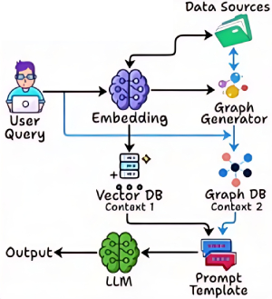

# Hybrid RAG [RAG]

## Description

Is a retrieval-augmented generation framework that combines multiple retrieval strategies—such as dense and sparse retrieval—to enhance the quality and relevance of information provided to language models.
Unlike traditional RAG systems that rely on a single retrieval method, Hybrid RAG dynamically selects or fuses results from different retrieval approaches, leveraging their complementary strengths.
This enables the model to access a broader and more diverse set of knowledge, improving accuracy, robustness, and adaptability across a wide range of tasks and domains.
