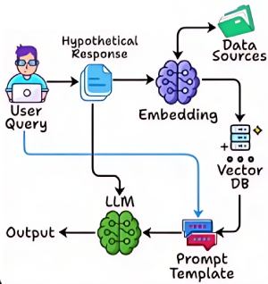

# HyDE {RAG}

## Description

HyDE (Hypothetical Document Embeddings) is a retrieval-augmented generation framework that enhances language models by generating hypothetical answers to a query before retrieving supporting documents.
Instead of directly searching for relevant passages, HyDE first prompts the model to create a plausible answer to the user's question. This hypothetical answer is then used as a query to retrieve documents that are semantically aligned with the generated response. By leveraging the model's generative capabilities to guide retrieval, HyDE can surface more contextually relevant information, especially in cases where the original query is ambiguous or under-specified. This approach is particularly effective for tasks requiring creative reasoning or when direct evidence is sparse, making it suitable for generating informed and context-aware responses.

!!! info

    مناسب برای تولید پاسخ‌های فرضی
