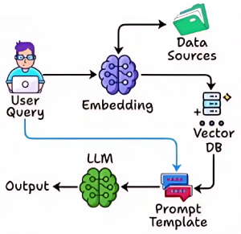

# Naive RAG (Standard) (Simple) [RAG]

## Description

Naive RAG is the simplest form of retrieval-augmented generation, where a language model retrieves documents based on the user's query and generates a response using the retrieved information.
This approach typically relies on basic similarity search (such as vector embeddings or keyword matching) to find relevant passages, without incorporating advanced reasoning, feedback loops, or multi-hop retrieval.
Naive RAG serves as a baseline for more sophisticated RAG frameworks, offering straightforward integration and fast response times.

While effective for direct and well-specified queries, Naive RAG may struggle with ambiguous questions, complex reasoning, or scenarios requiring iterative refinement.
It is best suited for applications where simplicity and speed are prioritized over depth and accuracy.

Use cases include FAQ bots, basic document search, and situations where quick retrieval and generation are sufficient.

!!! info

    مناسب برای جستجوی ساده و پاسخ‌های سریع

## Workflow

- **Step 1 - Query Input**: A user query or input is provided to the retrieval component of the system.
- **Step 2 - Retrieval Process**: The retriever searches a large corpus or database for documents or text passages that are most relevant to the query. This is often done using vector search or dense retrieval methods, where both the query and documents are encoded into high-dimensional vectors.
- **Step 3 - Selection of Top Documents**: The retriever ranks the documents based on their relevance to the query and selects the top-k documents (e.g., the top 5 most relevant passages).
- **Step 4 - Generative Response**: The selected documents are then passed to the generative model (like GPT). The model uses this context to generate a coherent response that directly answers the query while incorporating the retrieved information.
- **Step 5 - Output**: The final response is presented to the user, leveraging the retrieved content to enhance accuracy and detail.
