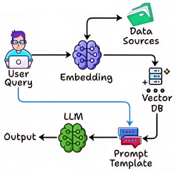
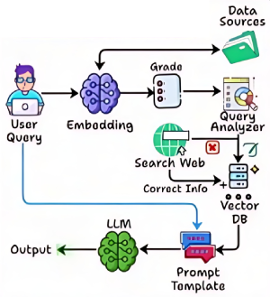
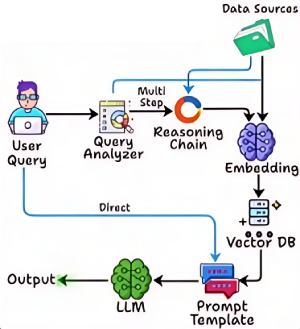
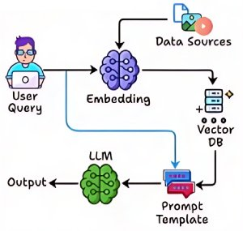
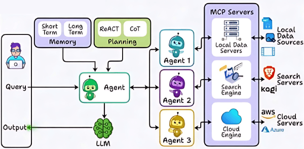
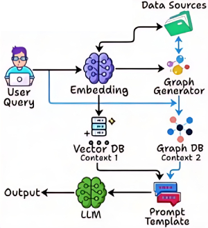
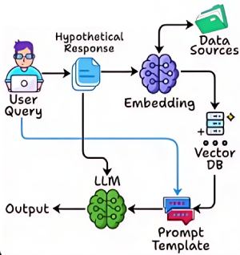

# RAG

## Description

Retrieval Augmented Generation (RAG) enhances language model capabilities by integrating an information retrieval component with a text generator.
This combination enables models to access external knowledge sources, improving factual accuracy and reliability.

- **Dynamic Knowledge Access**: RAG allows models to adapt to new information without needing complete retraining.
- **Factual Consistency**: By leveraging external data, RAG reduces the chances of generating incorrect or "hallucinated" content.

## Varieties

=== "Naive (Standard)"

    

    Naive RAG is the simplest form of retrieval-augmented generation, where a language model retrieves documents based on the user's query and generates a response using the retrieved information.
    This approach typically relies on basic similarity search (such as vector embeddings or keyword matching) to find relevant passages, without incorporating advanced reasoning, feedback loops, or multi-hop retrieval.
    Naive RAG serves as a baseline for more sophisticated RAG frameworks, offering straightforward integration and fast response times.

    While effective for direct and well-specified queries, Naive RAG may struggle with ambiguous questions, complex reasoning, or scenarios requiring iterative refinement.
    It is best suited for applications where simplicity and speed are prioritized over depth and accuracy.

    Use cases include FAQ bots, basic document search, and situations where quick retrieval and generation are sufficient.

=== "Corrective"

    

    Is designed to refine and improve the outputs of language models by incorporating corrective feedback loops.
    Unlike standard RAG systems that generate responses based solely on initial retrievals, Corrective RAG iteratively evaluates and adjusts its answers, leveraging additional retrievals or user feedback to address inaccuracies or incomplete information.

    This approach enhances the reliability and precision of generated content, making it particularly suitable for scenarios where high accuracy and iterative improvement are essential.

=== "Adaptive"

    

    Is an advanced framework that enhances language models by integrating dynamic retrieval and reasoning processes.
    Unlike traditional RAG systems that use a fixed number of retrieval steps, Adaptive RAG intelligently determines how many retrieval and generation cycles are needed based on the complexity of the task.

    This approach enables the model to efficiently handle multi-stage reasoning, adapt to diverse information needs, and provide more accurate and context-aware responses, making it especially effective for complex, multi-step workflows.

=== "Query Expansion"

    Query expansion (QE) is a technique in information retrieval (IR) that improves search engine performance by adding relevant terms to a user's initial query.
    This reformulation addresses the "vocabulary mismatch" problem, where users don't always use the exact words found in relevant documents.

    QE enhances search recall by retrieving documents that share similar meaning with the original query but might use different keywords, leading to more comprehensive results.

=== "Query Rewriting"

    Query rewriting is the process of transforming user queries to improve retrieval accuracy and performance, either by enhancing the query for a database or by generating multiple query variations for a search engine to improve information retrieval.

    This technique is used in both traditional database optimization and modern Retrieval-Augmented Generation (RAG) systems, where large language models (LLMs) rephrase vague questions, add keywords, and remove irrelevant details to better match document content, ultimately leading to more precise search results.

=== "Graph"

    

    Is a retrieval-augmented generation framework that leverages graph-based structures to enhance information retrieval and reasoning.
    Unlike traditional RAG systems that operate in a linear fashion, Graph RAG organizes retrieved knowledge as interconnected nodes and edges, enabling the model to traverse, aggregate, and reason over complex relationships between pieces of information.

    This approach allows for more nuanced, multi-hop reasoning and supports workflows where understanding the connections between facts is crucial, making it especially effective for tasks requiring structured knowledge integration and advanced contextual understanding.

=== "Multimodal"

    

    Multimodal RAG is a retrieval-augmented generation framework that integrates multiple data modalities—such as text, images, audio, and video—into the retrieval and generation process.
    Unlike traditional RAG systems that focus solely on textual information, Multimodal RAG leverages embeddings and retrieval techniques across diverse formats, enabling richer and more contextually relevant responses.

=== "Agentic"

    

    Is an advanced retrieval-augmented generation framework that empowers language models with agent-like capabilities.
    Unlike standard RAG systems, Agentic RAG enables the model to autonomously plan, decide, and execute multiple retrieval and reasoning steps, adapting its strategy based on the evolving context and task requirements.
    This approach allows for more flexible, interactive, and goal-driven workflows, making it highly effective for complex problem-solving and dynamic information gathering.

=== "Speculative"

    Speculative RAG is an approach that involves generating multiple possible responses or outputs for a given input query, using a retrieval model to provide relevant information.
    The generated responses are then evaluated using a feedback mechanism to select the most plausible or relevant one.
    The goal is to enhance the model's ability to produce accurate and contextually appropriate answers, especially when there is ambiguity or multiple potential interpretations of a query.

=== "Hybrid"

    

    Is a retrieval-augmented generation framework that combines multiple retrieval strategies—such as dense and sparse retrieval—to enhance the quality and relevance of information provided to language models.
    Unlike traditional RAG systems that rely on a single retrieval method, Hybrid RAG dynamically selects or fuses results from different retrieval approaches, leveraging their complementary strengths.

    This enables the model to access a broader and more diverse set of knowledge, improving accuracy, robustness, and adaptability across a wide range of tasks and domains.

=== "HyDE"

    

    HyDE (Hypothetical Document Embeddings) is a retrieval-augmented generation framework that enhances language models by generating hypothetical answers to a query before retrieving supporting documents.
    Instead of directly searching for relevant passages, HyDE first prompts the model to create a plausible answer to the user's question.
    This hypothetical answer is then used as a query to retrieve documents that are semantically aligned with the generated response.
    By leveraging the model's generative capabilities to guide retrieval, HyDE can surface more contextually relevant information, especially in cases where the original query is ambiguous or under-specified.
    This approach is particularly effective for tasks requiring creative reasoning or when direct evidence is sparse, making it suitable for generating informed and context-aware responses.

## Workflow

=== "Naive (Standard)"

    - **Step 1 - Query Input**: A user query or input is provided to the retrieval component of the system.
    - **Step 2 - Retrieval Process**: The retriever searches a large corpus or database for documents or text passages that are most relevant to the query. This is often done using vector search or dense retrieval methods, where both the query and documents are encoded into high-dimensional vectors.
    - **Step 3 - Selection of Top Documents**: The retriever ranks the documents based on their relevance to the query and selects the top-k documents (e.g., the top 5 most relevant passages).
    - **Step 4 - Generative Response**: The selected documents are then passed to the generative model (like GPT). The model uses this context to generate a coherent response that directly answers the query while incorporating the retrieved information.
    - **Step 5 - Output**: The final response is presented to the user, leveraging the retrieved content to enhance accuracy and detail.

=== "Corrective"

    - **Step 1 - Initial Retrieval and Generation**: The process begins like Standard RAG, where the retriever fetches relevant information and the generative model creates a response.
    - **Step 2 - Validation Process**: The generated response is then validated against a trusted dataset or source. This could involve comparing the generated content with data from authoritative sources (like medical databases, academic papers, or trusted news outlets).
    - **Step 3 - Correction Mechanism**: If discrepancies or errors are detected during validation, the model uses the feedback to correct the response. This might involve generating a new response or refining the existing one.
    - **Step 4 - Iteration and Feedback Loop**: The system iterates this process, continuously refining the response until it aligns with the correct information or falls within an acceptable error margin.
    - **Step 5 - Final Output**: The validated and corrected response is provided to the user.

=== "Speculative"

    - **Step 1 - Retrieval**: Similar to Standard RAG, it starts by retrieving multiple documents relevant to the query.
    - **Step 2 - Generative Speculation**: The generative model creates multiple speculative responses based on the retrieved documents. Instead of producing a single answer, it explores several possible outputs.
    - **Step 3 - Feedback and Ranking**: Each of the generated responses is evaluated using a feedback mechanism that scores them based on various criteria like relevance, coherence, completeness, and factual accuracy. This could involve comparing the responses against additional retrieved documents or using scoring models.
    - **Step 4 - Selection Process**: The model ranks all possible responses and selects the highest-scoring one as the final output.
    - **Step 5 - Presentation**: The chosen response is then presented to the user as the final answer.

## Query Formulation Strategies

Query formulation strategies in LLM-based RAG systems aim to enhance retrieval by improving the expressiveness and coverage of user queries.

=== "Prompt-Based Query Rewriting"

    With LLMs, prompts can be crafted to explicitly instruct the model to generate reformulated queries.
    This is particularly useful in multilingual or multi-domain RAG systems, where queries need to be adapted to match the style and vocabulary of the target corpus.

=== "Synonym/Paraphrase Expansion"

    This involves generating semantically equivalent alternatives using LLMs or lexical resources.
    For example, expanding "climate change impact" to include "effects of global warming" or "environmental consequences of climate change" can help match a broader range of documents.

=== "Contextual Reformulation"

    LLMs can reinterpret queries by inferring their intent based on conversational or document context.
    This helps in tailoring the query to better align with how the information might be expressed in the knowledge base.

=== "Pseudo-Relevance Feedback"

    Also known as blind relevance feedback, this strategy involves running an initial query, analyzing the top-ranked documents for salient terms, and using these terms to expand the query.
    While effective, it requires safeguards against topic drift.

=== "Template-Based Augmentation"

    Useful in structured domains, this method uses domain- specific templates or patterns to systematically generate variants.
    For example, a medical query about "treatment for hypertension" might also include "hypertension therapy" or "managing high blood pressure."

=== "Entity/Concept Linking"

    Named entities and domain concepts in the query are identified and replaced or augmented with their aliases, definitions, or hierarchical relations.
    This is often guided by ontologies or knowledge graphs.

## Example

=== "Naive (Standard)"

    ```python
    from sentence_transformers import SentenceTransformer, util
    from transformers import AutoModelForCausalLM, AutoTokenizer

    class AdvancedRAG:
        def __init__(self, retriever_model, knowledge_base):
            self.retriever = SentenceTransformer(retriever_model)
            self.knowledge_base = knowledge_base
            self.doc_embeddings = self.retriever.encode(knowledge_base, convert_to_tensor=True)

        def retrieve(self, query, top_k=3):
            query_embedding = self.retriever.encode(query, convert_to_tensor=True)
            scores = util.cos_sim(query_embedding, self.doc_embeddings)[0]
            top_results = scores.topk(k=top_k)
            retrieved_docs = [self.knowledge_base[idx] for idx in top_results.indices]
            return retrieved_docs

    class GenerativeRAG(AdvancedRAG):
        def __init__(self, retriever_model, generator_model, knowledge_base):
            super().__init__(retriever_model, knowledge_base)
            self.generator = AutoModelForCausalLM.from_pretrained(generator_model)
            self.generator_tokenizer = AutoTokenizer.from_pretrained(generator_model)

        def generate_response(self, query, max_length=100):
            retrieved_docs = self.retrieve(query)
            context = "\n".join(retrieved_docs)
            prompt = f"Context:\n{context}\n\nQuestion: {query}\nAnswer:"
            inputs = self.generator_tokenizer(prompt, return_tensors="pt")
            outputs = self.generator.generate(inputs, max_length=max_length)
            return self.generator_tokenizer.decode(outputs[0], skip_special_tokens=True)

    knowledge_base = [
        "The Eiffel Tower is located in Paris, France.",
        "The Great Wall of China is visible from space is a myth.",
        "Python is a high-level programming language."
    ]
    retriever_model = "all-MiniLM-L6-v2"
    generator_model = "gpt2-medium"
    rag_system = GenerativeRAG(retriever_model, generator_model, knowledge_base)
    query = "Where is the Eiffel Tower located?"
    response = rag_system.generate_response(query)
    print("Generated response:", response)
    ```

=== "Corrective"

    ```python
    import torch
    from transformers import AutoModelForCausalLM, AutoTokenizer

    class CorrectiveRAG:
        def __init__(self, retriever, max_steps=3):
            self.retriever = retriever
            self.generator = AutoModelForCausalLM.from_pretrained("gpt2-medium")
            self.tokenizer = AutoTokenizer.from_pretrained("gpt2-medium")
            self.max_steps = max_steps

        def retrieve_and_generate(self, query: str) -> str:
            context = ""
            for step in range(self.max_steps):
                retrieved_docs = self.retriever.retrieve(query + " " + context, k=3)
                context += " ".join(retrieved_docs) + " "

                prompt = f"Context: {context}\nQuery: {query}\nResponse:"
                inputs = self.tokenizer(prompt, return_tensors="pt")
                outputs = self.generator.generate(inputs, max_length=200)
                response = self.tokenizer.decode(outputs[0], skip_special_tokens=True)
                if self._is_response_complete(response):
                    break
                query = self._generate_follow_up_query(query, response)

            return response

        def _is_response_complete(self, response: str) -> bool:
            # Implement logic to determine if the response is complete
            return "I don't have enough information" not in response

        def _generate_follow_up_query(self, original_query: str, current_response: str) -> str:
            prompt = f"Original question: {original_query}\nCurrent answer: {current_response}\nGenerate a follow-up question to gather more information:"
            inputs = self.tokenizer(prompt, return_tensors="pt")
            outputs = self.generator.generate(inputs, max_length=50)
            return self.tokenizer.decode(outputs[0], skip_special_tokens=True)

    multi_step_rag = CorrectiveRAG(...)
    response = multi_step_rag.retrieve_and_generate("What are the effects of climate change on biodiversity?")
    print(response)
    ```

=== "Adaptive"

    ```python
    from enum import Enum
    from transformers import AutoModelForCausalLM, AutoTokenizer

    class TaskType(Enum):
        FACTUAL_QA = 1
        SUMMARIZATION = 2
        ANALYSIS = 3

    class AdaptiveRAG:
        def __init__(self, retriever):
            self.retriever = retriever
            self.generator = AutoModelForCausalLM.from_pretrained("gpt2-medium")
            self.tokenizer = AutoTokenizer.from_pretrained("gpt2-medium")

        def retrieve_and_generate(self, query: str, task_type: TaskType) -> str:
            if task_type == TaskType.FACTUAL_QA:
                k = 3
                prompt_template = "Context: {context}\nQuestion: {query}\nAnswer:"
            elif task_type == TaskType.SUMMARIZATION:
                k = 10
                prompt_template = "Summarize the following information:\n{context}\nSummary:"
            elif task_type == TaskType.ANALYSIS:
                k = 5
                prompt_template = "Analyze the following information:\n{context}\nQuery: {query}\nAnalysis:"

            retrieved_docs = self.retriever.retrieve(query, k=k)
            context = " ".join(retrieved_docs)
            prompt = prompt_template.format(context=context, query=query)
            inputs = self.tokenizer(prompt, return_tensors="pt")
            outputs = self.generator.generate(inputs, max_length=300)
            response = self.tokenizer.decode(outputs[0], skip_special_tokens=True)
            return response

    adaptive_rag = AdaptiveRAG(...)
    factual_response = adaptive_rag.retrieve_and_generate("What is the capital of France?", TaskType.FACTUAL_QA)
    summary_response = adaptive_rag.retrieve_and_generate("Summarize the causes of World War I", TaskType.SUMMARIZATION)
    analysis_response = adaptive_rag.retrieve_and_generate("Analyze the impact of social media on mental health", TaskType.ANALYSIS)
    ```

    !!! warning

        This is a simple implementation of Adaptive RAG; a more robust solution should be able to detect the task type automatically.

=== "Query Expansion"

    ```python
    from transformers import pipeline

    class QueryExpansionRAG(AdvancedRAG):
        def __init__(self, model_name, knowledge_base, query_expansion_model="t5-small"):
            super().__init__(model_name, knowledge_base)
            self.query_expander = pipeline("text2text-generation", model=query_expansion_model)

        def retrieve(self, query, k=5):
            expanded_queries = self._expand_query(query)
            all_retrieved = []
            for q in expanded_queries:
                all_retrieved.extend(super().retrieve(q, k))
            # Remove duplicates and return top k
            unique_retrieved = list(dict.fromkeys(all_retrieved))
            return unique_retrieved[:k]

        def _expand_query(self, query):
            prompt = f"expand query: {query}"
            expanded = self.query_expander(prompt, max_length=50, num_return_sequences=3)
            return [query] + [e['generated_text'] for e in expanded]

    rag_system = QueryExpansionRAG(model_name, knowledge_base)
    retrieved_docs = rag_system.retrieve(query)
    print("Retrieved documents:", retrieved_docs)
    ```

    !!! warning

        Keep in mind that poorly expanded queries can introduce noise and reduce retrieval precision. In this implementation, expansions generated by the T5 model are combined with the original query, increasing coverage. However, to maintain a balance, consider reranking results using similarity scores or assigning lower weights to generated expansions during retrieval. This helps ensure that expansions improve recall without compromising the alignment with the original intent.

=== "Graph"

    ```python
    import torch
    import networkx as nx
    from sentence_transformers import SentenceTransformer
    from transformers import AutoModelForCausalLM, AutoTokenizer
    from node2vec import Node2Vec

    class KnowledgeGraph:
        def __init__(self):
            self.nodes: dict[str, dict] = {}
            self.edges: dict[str, list[tuple[str, str]]] = {}

        def add_node(self, node_id: str, properties: dict):
            self.nodes[node_id] = properties

        def add_edge(self, source: str, target: str, relation: str):
            if source not in self.edges: self.edges[source] = []
            self.edges[source].append((target, relation))

        def get_neighbors(self, node_id: str) -> list[tuple[str, str]]:
            return self.edges.get(node_id, [])

    class GraphRAG:
        def __init__(self, kg: KnowledgeGraph, model_name: str):
            self.kg = kg
            self.model = SentenceTransformer(model_name)
            self.graph = self._build_networkx_graph()
            self.node_embeddings = self._compute_node_embeddings()

        def _build_networkx_graph(self):
            G = nx.DiGraph()
            for node_id, properties in self.kg.nodes.items(): G.add_node(node_id, properties)
            for source, edges in self.kg.edges.items():
                for target, relation in edges: G.add_edge(source, target, relation=relation)
            return G

        def _compute_node_embeddings(self):
            embeddings = {}
            for node_id, properties in self.kg.nodes.items():
                text = f"{node_id} {' '.join(properties.values())}"
                embeddings[node_id] = self.model.encode(text)
            return embeddings

        def retrieve(self, query: str, k: int = 5) -> list[str]:
            query_embedding = self.model.encode(query)
            similarities = {node_id: torch.cosine_similarity(torch.tensor(query_embedding), torch.tensor(emb), dim=0) for node_id, emb in self.node_embeddings.items()}
            return sorted(similarities, key=similarities.get, reverse=True)[:k]

    class AdvancedGraphRAG(GraphRAG):
        def __init__(self, kg: KnowledgeGraph, model_name: str):
            super().__init__(kg, model_name)
            self.node2vec_embeddings = self._compute_node2vec_embeddings()

        def _compute_node2vec_embeddings(self):
            node2vec = Node2Vec(self.graph, dimensions=64, walk_length=30, num_walks=200, workers=4)
            model = node2vec.fit(window=10, min_count=1)
            return {node: model.wv[node] for node in self.graph.nodes()}

        def retrieve(self, query: str, k: int = 5) -> list[str]:
            query_embedding = self.model.encode(query)
            combined_similarities = {}
            for node_id in self.graph.nodes():
                text_sim = torch.cosine_similarity(torch.tensor(query_embedding), torch.tensor(self.node_embeddings[node_id]), dim=0)
                graph_sim = torch.cosine_similarity(torch.tensor(query_embedding), torch.tensor(self.node2vec_embeddings[node_id]), dim=0)
                combined_similarities[node_id] = 0.5 * text_sim + 0.5 * graph_sim
            return sorted(combined_similarities, key=combined_similarities.get, reverse=True)[:k]

    class GenerativeGraphRAG(AdvancedGraphRAG):
        def __init__(self, kg: KnowledgeGraph, retriever_model: str, generator_model: str):
            super().__init__(kg, retriever_model)
            self.generator = AutoModelForCausalLM.from_pretrained(generator_model)
            self.generator_tokenizer = AutoTokenizer.from_pretrained(generator_model)

        def generate_response(self, query: str, max_length: int = 100) -> str:
            retrieved_nodes = self.retrieve(query)
            context = self._build_graph_context(retrieved_nodes)
            prompt = f"Graph Context:\n{context}\n\nQuestion: {query}\nAnswer:"
            inputs = self.generator_tokenizer(prompt, return_tensors="pt")
            outputs = self.generator.generate(inputs, max_length=max_length)
            return self.generator_tokenizer.decode(outputs[0], skip_special_tokens=True)

        def _build_graph_context(self, nodes: list[str]) -> str:
            context = []
            for node in nodes:
                context.append(f"Node: {node}")
                context.append(f"Properties: {self.graph.nodes[node]}")
                for neighbor, edge_data in self.graph[node].items():
                    context.append(f" Related to {neighbor} by {edge_data['relation']}")
            return "\n".join(context)

    kg = KnowledgeGraph()
    kg.add_node("Paris", {"type": "City", "country": "France"})
    kg.add_node("France", {"type": "Country", "continent": "Europe"})
    kg.add_edge("Paris", "France", "capital_of")

    generative_graph_rag = GenerativeGraphRAG(kg, "all-MiniLM-L6-v2", "gpt2-medium")
    response = generative_graph_rag.generate_response("What is the capital of France?")
    print("Generated response:", response)
    ```
