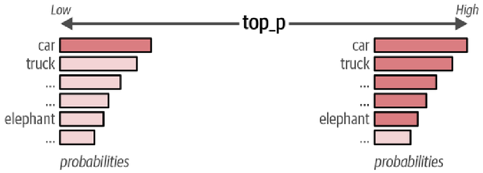

# top_p *

## Description

A higher `top_p` increases the number of tokens that can be selected to generate and vice versa.

## Example

| Token | Probability |
| ----- | ----------- |
| A     | 0.50        |
| B     | 0.20        |
| C     | 0.15        |
| D     | 0.07        |
| E     | 0.04        |

If `top_p = 0.9`:

- Cumulative: A = 0.50
- Step 1: A + B = 0.70
- Step 2: A + B + C = 0.85
- Step 3: A + B + C + D = 0.92 (Stops here because 0.92 > 0.9)
- Keeps: A, B, C, D (4 tokens)
