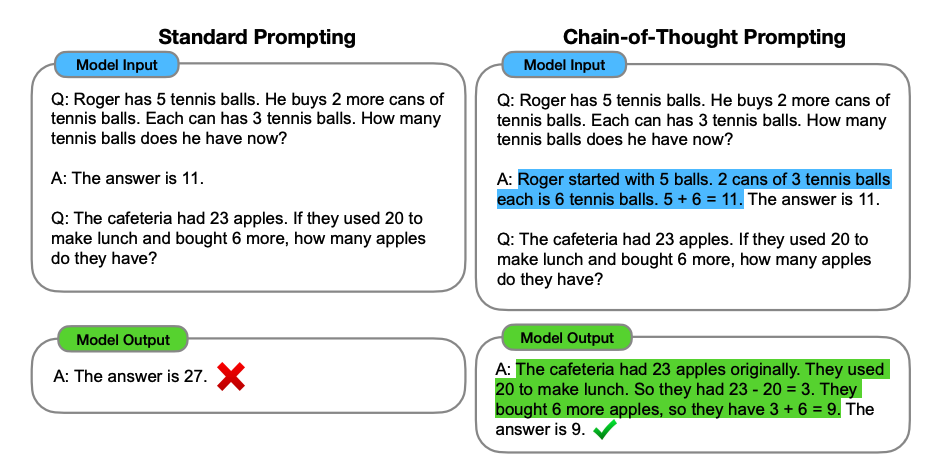
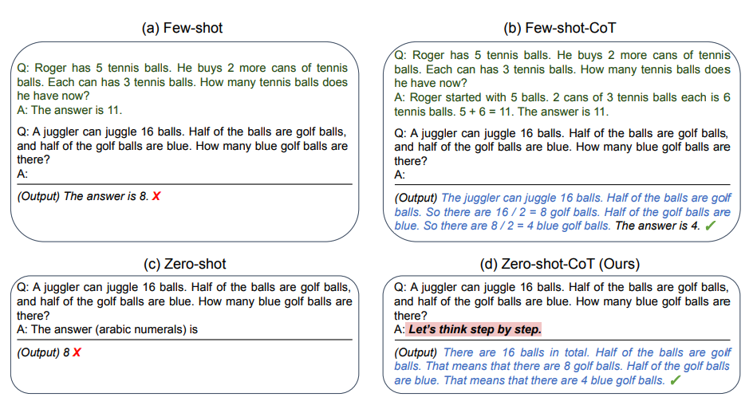

# Chain-of-Thought (CoT)

## Description

Enables complex reasoning capabilities through intermediate reasoning steps. (In the following image we can see an example of a Few-shot CoT Prompting)



## Few-Shot & Zero-Shot CoT Prompting

- **Few-Shot**: Combining the original prompt with few-shot prompting.
- **Zero-Shot**: Involves adding "Let's think step by step" to the original prompt.



!!! info

    Although the prompt "Let's think step by step" can improve the output, you are not constrained by this exact formulation. Alternatives exist like "Take a deep breath and think step-by-step" and "Let's work through this problem step-by-step."

## Example

=== "Prompt"

    ```python
    def cot_prompt(problem):
        prompt = f"""
        Solve the following problem step by step:

        Problem: {problem}

        Let's approach this step by step:
        1) First, we need to...
        2) Next, we should...
        3) Then, we can...
        4) Finally, we...

        Therefore, the answer is...

        Now, solve this new problem using the same step-by-step approach:

        {problem}

        Let's solve this step by step:
        """
        return prompt

    problem = "If a train travels 120 km in 2 hours, what is its average speed in km/h?"
    prompt = cot_prompt(problem)
    print(prompt)
    ```

=== "Adaptive"

    ```python
    def adaptive_cot(model, tokenizer, problem, complexity_threshold=0.7):
        complexity = assess_problem_complexity(problem)  # Assess problem complexity
        if complexity > complexity_threshold:
            return detailed_cot(model, tokenizer, problem)  # Use detailed CoT for complex problems
        else:
            return simple_solve(model, tokenizer, problem)  # Use simple direct approach for simpler problems

    def assess_problem_complexity(problem):
        # Implement logic to assess problem complexity
        # This could involve keyword analysis, sentence structure, etc.
        pass

    def detailed_cot(model, tokenizer, problem):
        # Implement detailed Chain-of-Thought approach
        pass

    def simple_solve(model, tokenizer, problem):
        # Implement simple direct solving approach
        pass

    problem = "What is the result of 25 divided by 5?"
    solution = adaptive_cot(model, tokenizer, problem)
    print(solution)
    ```

=== "Zero-Shot"

    ```python
    prompt = """
    Problem: {problem}

    Let's think step by step:
    """

    problem = "If a recipe calls for 2 cups of flour for 8 servings, how many cups of flour are needed for 12 servings?"
    prompt.format(problem=problem)
    ```

=== "Few-Shot"

    ```python
    prompt = """
    Solve the following problem step by step:

    Problem: If a train travels 120 km in 2 hours, what is its average speed in km/h?

    Let's approach this step by step:
    1) First, we need to recall the formula for average speed, which is: Average Speed = Total Distance / Total Time.
    2) Next, we should identify the total distance traveled, which is 120 km.
    3) Then, we can identify the total time taken, which is 2 hours.
    4) Now, we will apply the formula: Average Speed = 120 km / 2 hours.
    5) Finally, we calculate the result: Average Speed = 60 km/h.

    Therefore, the answer is 60 km/h.

    Now, solve this new problem using the same step-by-step approach:

    Problem: {problem}

    Let's solve this step by step:
    """

    problem = "If a recipe calls for 2 cups of flour for 8 servings, how many cups of flour are needed for 12 servings?"
    prompt.format(problem=problem)
    ```
