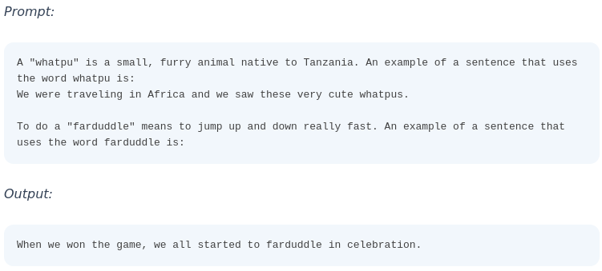

# Few-Shot *

## Description

Few-shot prompting involves providing examples within a prompt to guide a language model's response.

- This technique can significantly improve performance on tasks requiring context or specific formats.
- Models can better understand user intentions by showing how a task should be completed.
- It may struggle with more complex reasoning tasks, necessitating further techniques for optimal outcomes.
