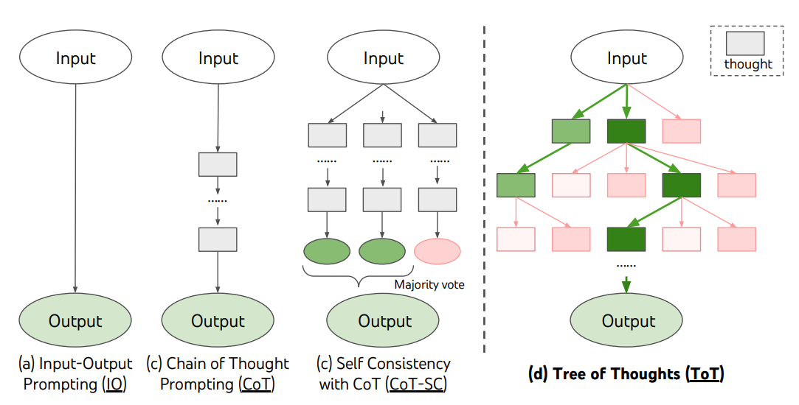
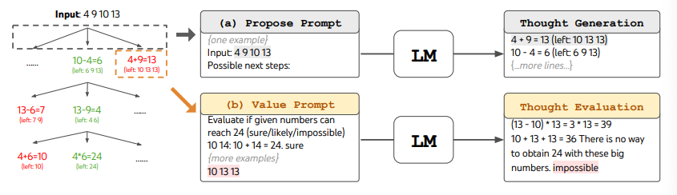

# Tree-of-Thoughts (ToT)

## Descriptions

The "Tree of Thoughts" (ToT) framework enhances complex problem-solving by maintaining a tree of thoughts, allowing language models to explore and evaluate intermediate steps.



It combines thought generation with search algorithms like breadth-first and depth-first search for systematic exploration. This approach helps identify potential solutions by categorizing thoughts as "sure," "maybe," or "impossible," promoting effective partial solutions while eliminating unfeasible ones.



## Zero-Shot Tree-of-Thoughts

A disadvantage of ToT method is that it requires many calls to the generative models, which slows the application significantly. Fortunately, there has been a successful attempt to convert the tree-of-thought framework into a simple prompting technique.

Instead of calling the generative model multiple times, we ask the model to mimic that behavior by emulating a conversation between multiple experts. These experts will question each other until they reach a consensus.

## Example

```python
zeroshot_tot_prompt = [
    {
        "role": "user",
        "content": "Imagine three different experts are answering this question. All experts will write down 1 step of their thinking, then share it with the group. Then all experts will go on to the next step, etc. If any expert realizes they're wrong at any point then they leave. The question is 'The cafeteria had 23 apples. If they used 20 to make lunch and bought 6 more, how many apples do they have?' Make sure to discuss the results."
    }
]
outputs = pipe(zeroshot_tot_prompt)
print(outputs[0]["generated_text"])
```

```text
Expert 1: Step 1 - Start with the initial number of apples: 23 apples.
Expert 2: Step 1 - Subtract the apples used for lunch: 23 - 20 = 3 apples remaining.
Expert 3: Step 1 - Add the newly bought apples: 3 + 6 = 9 apples.
Expert 1: Step 2 - Confirm the final count: The cafeteria has 9 apples.
Expert 2: Step 2 - Review the calculations: 23 - 20 = 3, then 3 + 6 = 9. The calculations are correct.
Expert 3: Step 2 - Agree with the result: The cafeteria indeed has 9 apples.
All experts agree on the final count: The cafeteria has 9 apples.
```
