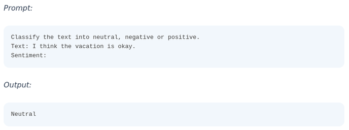

# Zero-Shot *

## Description

Allows large language models to perform tasks without providing examples in the prompt.
For instance, you might instruct the model to classify text as "neutral," "negative," or "positive" without prior examples.

- This technique relies on the model's training and understanding of the task.
- If zero-shot prompting is insufficient, you can switch to few-shot prompting by including examples.
