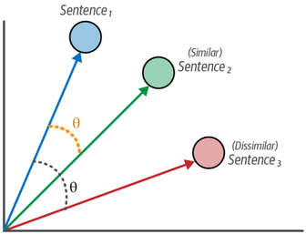

# Cosine Similarity [Embedding]

## Description

The cosine similarity loss is intuitive and easy to use.
It works across many different use cases and datasets.
It is typically used in semantic textual similarity tasks, in which a similarity score is assigned to the pairs of texts over which we optimize the model.

Instead of strictly positive or negative pairs of sentences, we assume pairs of sentences similar or dissimilar to a certain degree, typically, this value lies between 0 and 1 to indicate dissimilarity and similarity, respectively.

Cosine similarity loss is straightforward—it calculates the cosine similarity between the two embeddings of the two texts and compares that to the labeled similarity score.
The model will learn to recognize the degree of similarity between sentences.

## Formula

$$
similarity(S_1, S_2) = \dfrac{||S_1|| \, ||S_2|| \, \times \cos(\theta)}{||S_1|| \, ||S_2||}
$$
