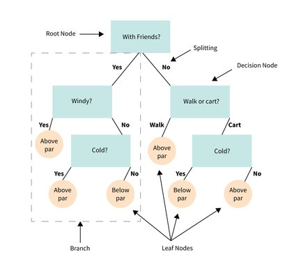
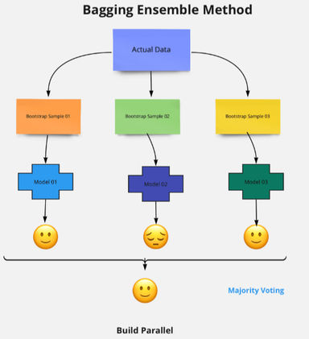
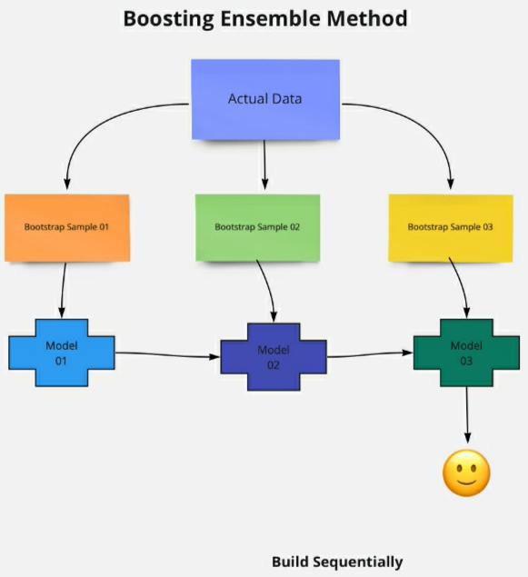
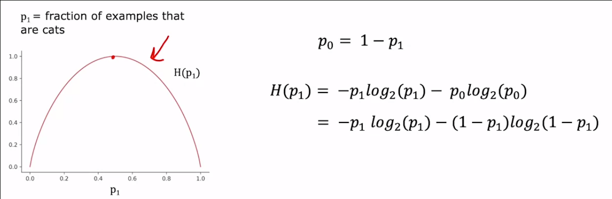
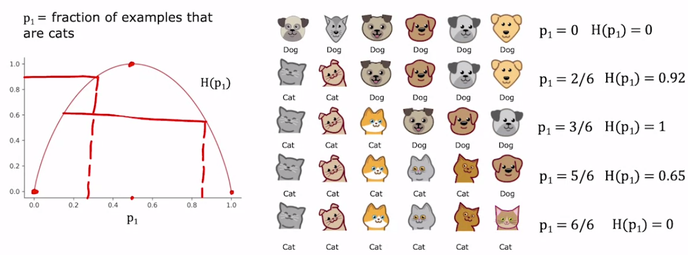
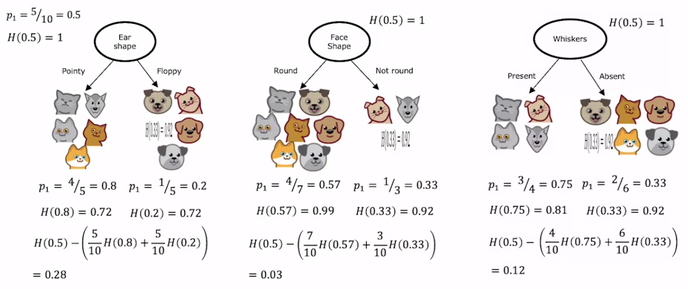
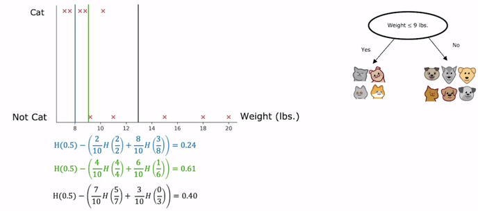

# Decision Trees * [Sup] {Random Forest} {XGBoost}

## Description

Introduction Decision Trees are a type of Supervised Machine Learning (that is you explain what the input is and what the corresponding output is in the training data) where the data is continuously split according to a specific parameter.
The tree can be explained by two entities, namely decision nodes, and leaves.



<span dir="rtl">همیشه باید بشکنه به دو تا حالت (Ture یا False) اگر فیچری داشتیم که باعث میشد سه یا بیشتر حالت پیش بیاد با اون فیچر رو به حالت های ریز تر که Ture یا False ای هستن بشکنیم</span>

## Varieties

=== "Random Forest"

    The random forest is a classification algorithm consisting of many decision trees.
    It uses bagging and features randomness when building each tree to try to create an uncorrelated forest of trees whose prediction by committee is more accurate than that of any individual tree.

    

    One of the most commonly known ensemble models is random forest, where the model combines the predictions of multiple decision trees and outputs the predictions.
    This is usually more accurate and prone to overfitting.

    <span dir="rtl">تو این الگوریتم با انتخاب تصادفی از دیتا ست اصلی چندین دیتا ست کوچیک تر میسازه و از رو هر کدوم یک decision tree میسازه و ورودی رو به همه اون ها میده و در نهایت بین جواب های حاصل برایند میگیره و نظر نهاییش رو اعلام میکنه</span>

=== "XGBoost"

    XGBoost (eXtreme Gradient Boosting) is a popular supervised-learning algorithm used for regression and classification on large datasets.
    It uses sequentially-built shallow decision trees to provide accurate results and a highly scalable training method that avoids overfitting.

    

    <span dir="rtl">بر خلاف random forest که دیتاست های رندم میسازه، تو این الگو یک دیتا ست اولیه میسازه و بر اساسش یک decision tree میسازه و با تست کردن نتایج و پیدا کردن نقاط ضعفش این بار یک دیتاست دقیق تر رو انتخاب میکنه دوباره decision tree رو ایجاد میکنه، انقدر این کارو تکرار میکنه تا یه decision tree کامل و با کمترین اشکال ایجاد کنه.</span>

## Workflow

=== "CART Algorithm"

    Classification and Regression Tree (CART) algorithm, trains decision trees (also called "growing" trees).
    The algorithm works by first splitting the training set into two subsets using a single feature $k$ and a threshold $t_k$.
    How does it choose $k$ and $t_k$?
    It searches for the pair $(k, t_k)$ that produces the purest subsets, weighted by their size.

    CART cost function for classification:

    $$
    J(k, t_k) = \frac{m_{\text{left}}}{m} G_{\text{left}} + \frac{m_{\text{right}}}{m} G_{\text{right}}
    $$

    - $G_{\text{left/right}}$: Measures the impurity of the left/right subset
    - $m_{\text{left/right}}$: Number of instances in the left/right subset
    - $m$: $m_{\text{left}} + m_{\text{right}}$

    Once the CART algorithm has successfully split the training set in two, it splits the subsets using the same logic, then the sub-subsets, and so on, recursively.
    It stops recursing once it reaches the maximum depth, or if it cannot find a split that will reduce impurity.

    !!! warning

        The CART algorithm is a greedy method that makes the best split at each level without considering future consequences. This approach produces a good, but not guaranteed optimal, solution.

=== "Information Gain"

    

    - <span dir="rtl">از این فرمول برای انتخاب ترتیب شکستن شاخه ها استفاده میشه</span>
    - <span dir="rtl">هر چقدر یک ویژگی (feature یا input) به ما entropy بهتری بده (نزدیکتر به ۰) به این معنیه که اول بر اساس اون ویژگی بشکنیم بعدش بریم سراغ ویژگی های بعدی</span>

    

    <span dir="rtl">تو تصویر بالا جایی که هیچکدوم از حیوون ها گربه نیستن فرمول به ما ۰ داده و همینطور جایی که همه شون گربه هستن هم ۰ داده (فرقی نداره که همه باشن یا هیچکدوم نباشن، همین که purity رعایت بشه کافیه)</span>

    

    <span dir="rtl">حالا وقتی میخوایم از فرمول entropy برای decision trees استفاده کنیم، باید entropy هر طرف رو حساب کنیم، میانگینش رو بدست بیاریم (میانگین بر اساس تعداد دیتاهای هر سمت) و آخرسر نتیجه رو از entropy اولیه دیتا ست کم کنیم، به این فرمول میگن فرمول information gain که هرچقدر حاصل فرمول information gain بیشتر باشه یعنی گزینه بهتریه. (تو تصویر چون information gain سمت چپی بیشتره پس بر اساس اون دیتا مون رو میشکنیم)</span>

    <span dir="rtl">برای فیچر هایی که یک مقدار ثابت ندارن (مثلا وزن) با استفاده از تکنیک تصویر زیر اون هارو به حالت True و False ای تغییر میدیم:</span>

    

=== "VS"

    | Aspect               | CART                                                              | Information Gain                                                                          |
    | -------------------- | ----------------------------------------------------------------- | ----------------------------------------------------------------------------------------- |
    | **Impurity measure** | Gini (for classification) or MSE (for regression)                 | Entropy                                                                                   |
    | **Splitting style**  | Binary only                                                       | Binary or multiway                                                                        |
    | **Used in**          | `sklearn.DecisionTreeClassifier`, `sklearn.DecisionTreeRegressor` | ID3, C4.5, C5.0                                                                           |
    | **Computation**      | Slightly faster                                                   | Slightly slower                                                                           |
    | **Bias**             | Tends to prefer larger partitions with distinct classes           | Tends to prefer attributes with many distinct values (can be corrected with *Gain Ratio*) |

## Example

=== "Random Forest"

    ```python
    from sklearn.datasets import load_iris
    from sklearn.ensemble import RandomForestClassifier
    from sklearn.model_selection import train_test_split
    from sklearn.metrics import f1_score

    X, y = load_iris(return_X_y=True)  # Load sample data
    X_train, X_test, y_train, y_test = train_test_split(X, y, test_size=0.3, random_state=42)

    model = RandomForestClassifier(n_estimators=100, random_state=42)
    model.fit(X_train, y_train)

    y_pred = model.predict(X_test)
    print("F1 Score:", f1_score(y_test, y_pred, average="macro"))
    ```

=== "XGBoost"

    ```python
    from xgboost import XGBClassifier
    from sklearn.datasets import load_iris
    from sklearn.model_selection import train_test_split
    from sklearn.metrics import f1_score

    X, y = load_iris(return_X_y=True)  # Load sample data
    X_train, X_test, y_train, y_test = train_test_split(X, y, test_size=0.3, random_state=42)

    model = XGBClassifier(use_label_encoder=False, eval_metric="mlogloss", random_state=42)
    model.fit(X_train, y_train)

    y_pred = model.predict(X_test)
    print("F1 Score:", f1_score(y_test, y_pred, average="macro"))
    ```
