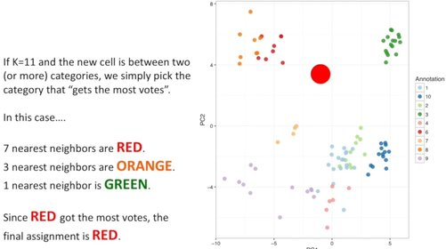

# KNN * [Sup] [Multilabel]

## Description

K-Nearest Neighbors (KNN) a non-parametric, supervised learning classifier, which uses proximity to make classifications or predictions about the grouping of an individual data point.



For example in the above image, the big red circle at first was unclassified and by using KNN it was classified by the nearest old classified data.

!!! info

    KNN naturally supports multilabel classification, where each data point can belong to multiple classes simultaneously. This is useful in scenarios like:

    - Document categorization (a document can belong to multiple topics)
    - Image tagging (an image can have multiple objects)
    - Gene function prediction (a gene can have multiple functions)

## Workflow

=== "Best Number For K"

    - There is no physical or biological way to determine the best value for "K", so you may have to try out a few values before settling on one. Do this by pretending part of the training data is "unknown".
    - Low values for K (like K=1 or K=2) can be noisy and subject to the effects of outliers.
    - Large values for K smooth over things, but you don't want K to be so large that a category with only a few samples in it will always be outvoted by other categories.

## Example

```python
from sklearn.datasets import load_iris
from sklearn.neighbors import KNeighborsClassifier
from sklearn.model_selection import train_test_split
from sklearn.metrics import f1_score

X, y = load_iris(return_X_y=True)  # Load sample data
X_train, X_test, y_train, y_test = train_test_split(X, y, test_size=0.3, random_state=42)

model = KNeighborsClassifier(n_neighbors=5)
model.fit(X_train, y_train)

y_pred = model.predict(X_test)
print("F1 Score:", f1_score(y_test, y_pred, average="macro"))
```
