# SVM [Sup]

## Description

Support Vector Machine (SVM) is a model used for both classification and regression problems though it is mostly used to solve classification problems.
The algorithm creates a hyperplane or line (decision boundary) which separates data into classes.
It uses the kernel trick to find the best line separator (decision boundary that has the same distance from the boundary point of both classes).

SVM tries to finds the maximal margin (distance between the line and the support vectors) that separates the classes and this reduces the risk of error on the data

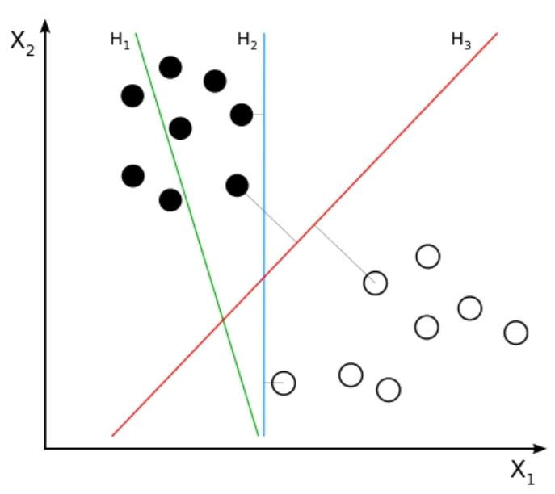

- $H_1$ does not separate the classes.
- $H_2$ does, but only with a small margin.
- $H_3$ separates them with the maximal margin.

## Workflow

=== "Hyperplane"

    A hyperplane is a decision boundary that differentiates the two classes in SVM.
    A data point falling on either side of the hyperplane can be attributed to different classes.
    The dimension of the hyperplane depends on the number of input features in the dataset.

    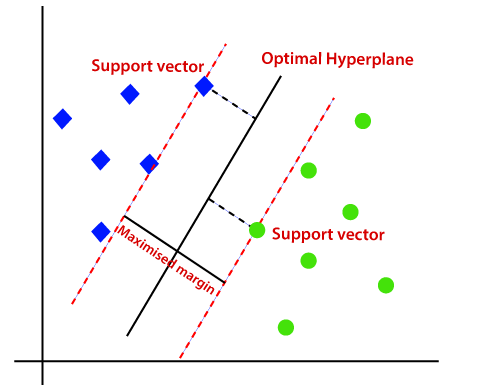

    In geometry, a hyperplane is a subspace whose dimension is one less than that of its ambient space.
    For example, if a space is 3-dimensional then its hyperplanes are the 2-dimensional planes, while if the space is 2-dimensional, its hyperplanes are the 1-dimensional lines.

=== "Soft Margin"

    Soft margin SVM allows some misclassification to happen by relaxing the hard constraints of Support Vector Machine.

    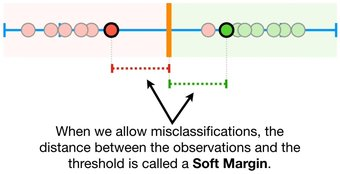

    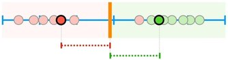

    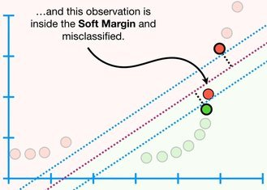

=== "Weird Shaped Data"

    SVM by using a **kernel function** will move the data into a higher dimension to make the classification possible.

    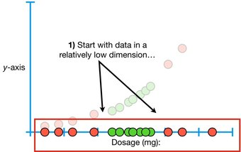

    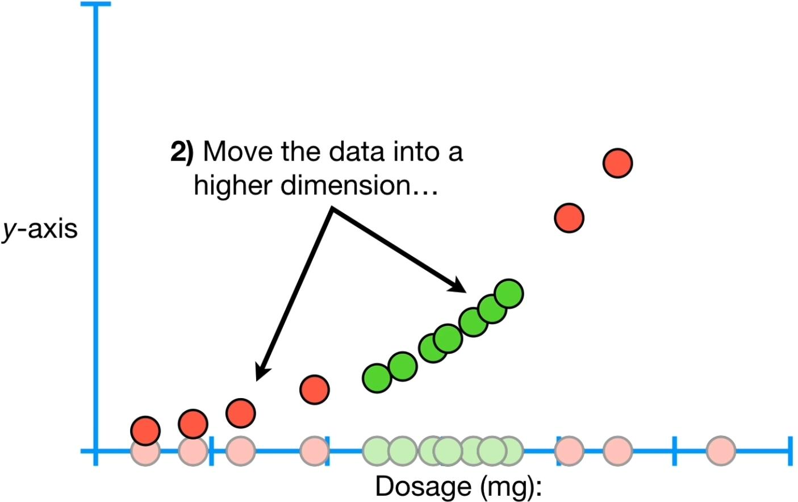

    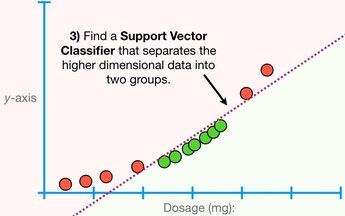

=== "Kernel Function"

    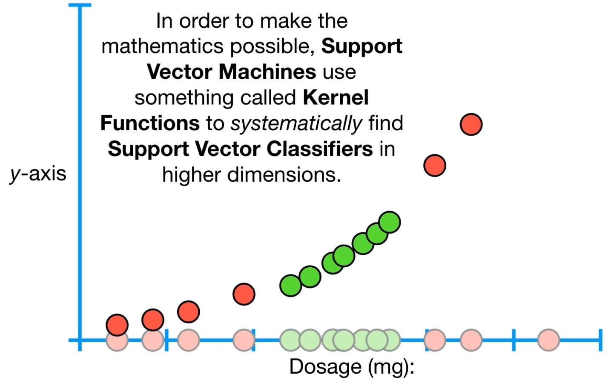

    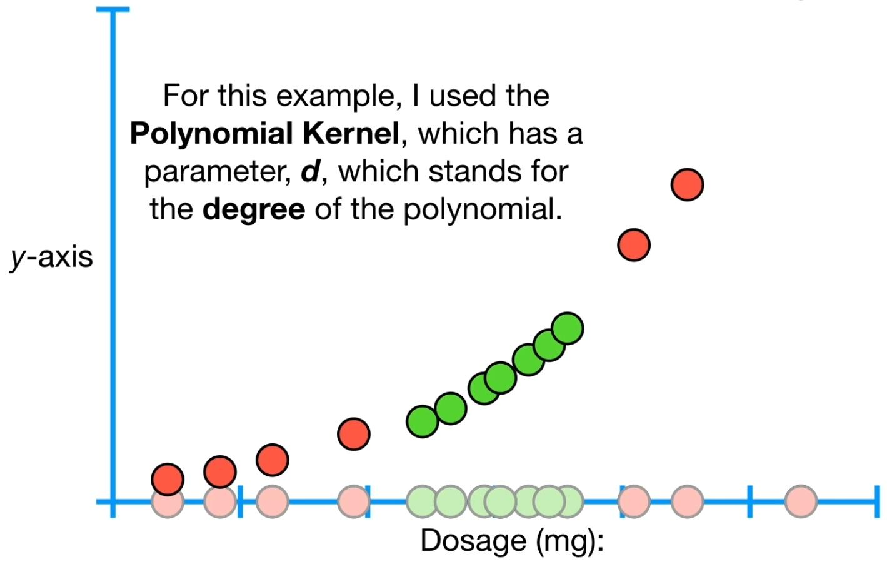

    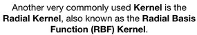

## Example

```python
from sklearn.datasets import load_iris
from sklearn.svm import SVC
from sklearn.model_selection import train_test_split
from sklearn.metrics import f1_score

X, y = load_iris(return_X_y=True)  # Load sample data
X_train, X_test, y_train, y_test = train_test_split(X, y, test_size=0.3, random_state=42)

model = SVC(kernel="rbf", random_state=42)
model.fit(X_train, y_train)

y_pred = model.predict(X_test)
print("F1 Score:", f1_score(y_test, y_pred, average="macro"))
```
