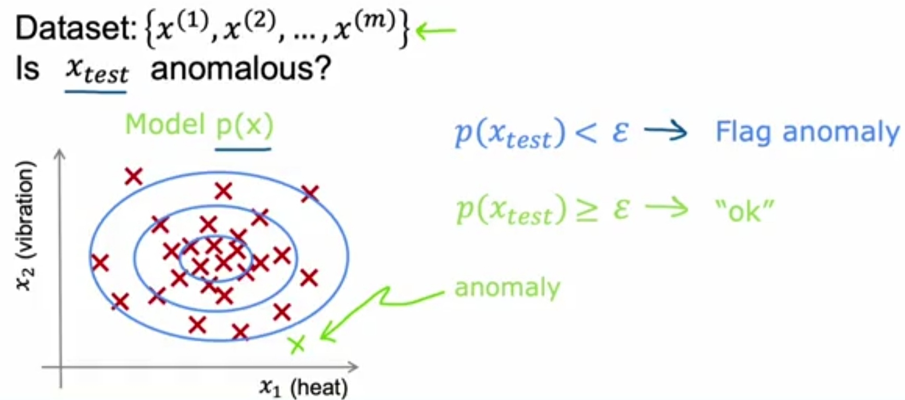
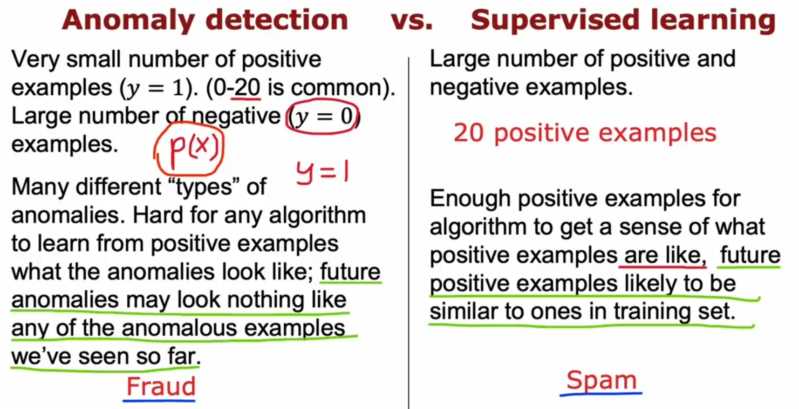
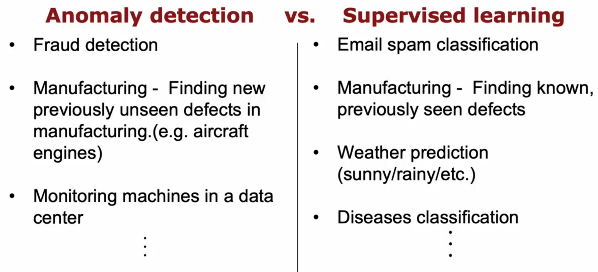

# Anomaly [Unsup]

## Description

Anomaly detection is any process that finds the outliers of a dataset; those items that don't belong.
These anomalies might point to unusual network traffic, uncover a sensor on the fritz, or simply identify data for cleaning, before analysis.

الگوی عملکردش این مدلیه که یه سری دیتای اولیه میگیره، اون های رو دسته بندی میکنه، بعدش که دیتای تست رو گرفت نگاه میکنه ببینه چقدر به مرکز طبیعی بودن نزدیکه، هر چقد دورتر از مرکز بود (یا به عبارت دیگه خروجی فانکشنش از اپسیلون کوچیکتر بود) یعنی احتمال خطا و غیر نرمال بودن تو اون دیتا تست هستش

## Formula (Gaussian)

همونطور که تو تصاویر بالا پیداس، یک نمودار بر رویی دیتاها مپ میکنیم که تو این نمودار $\mu$ وسط دیتاها رو مشخص میکنه و $\sigma$ عرض نمودار رو، در صورتی که دیتاهای ما بیشتر باشن هر کدوم $\mu$ و $\sigma$ مخصوص به خودشون رو خواهند داشت، و در نهایت برای بدست آوردن جواب نهایی، جواب فرمول هر دیتا رو در هم ضرب میکنیم.

## Anomaly vs Supervised

بطور کلی تفاوت اصلی این دو با هم اینه که Supervised روی تکرار موارد مشکل دار تمرکز داره، ولی Anomaly روی حفظ شرایط فعلی تمرکز داره، در نتیجه هرچی تو حالت فعلی نگنجه بعنی مشکل داره، با این تکنیک میشه حتی مشکلات ناشناخته توی سیستم رو هم پیدا کرد که Supervised این اجازه رو به ما نمیده
