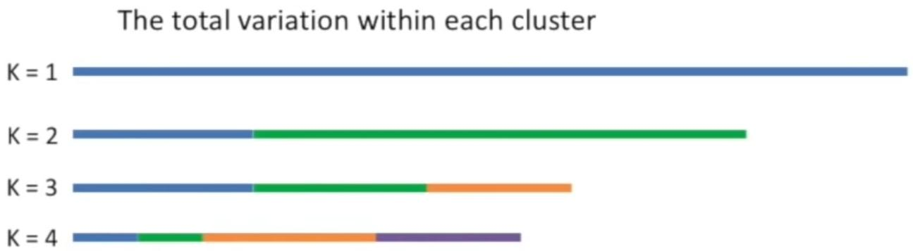
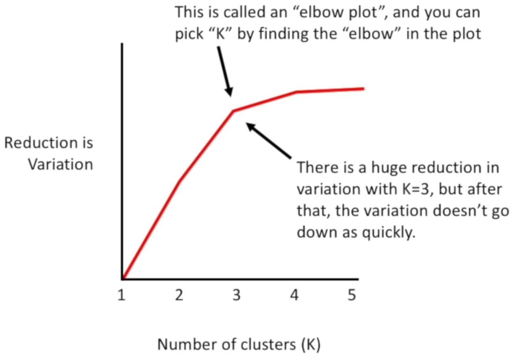

# K-Means * [Unsup] [Centroid-Based]

## Description

k-means clustering is a method of vector quantization, originally from signal processing, that aims to partition n observations into k clusters in which each observation belongs to the cluster with the nearest mean, serving as a prototype of the cluster.

## Workflow

=== "Steps"

    1. It picks two or more starting centroids (k of them) on the chart, measures the distance from every point to each centroid, and assigns each point to the closest centroid.
    2. Then, it finds the average position of all points assigned to each centroid and moves the centroid to that average spot. It repeats this for all centroids.
    3. After updating the centroids, it reassigns the points based on the new positions and keeps repeating these steps until the centroids stop moving.

=== "Best Number For K"

    How should I know which number is the best for the K (number of clusters)?

    We will select multiple numbers for it and each time we will check how the variation within each cluster changes.

    

    Then by creating the below diagram we can easily find the best point (the best number for K).

    

    Importantly, every time we increase the number of K, the variation in each cluster decreases, but it does not mean that we should continue this approach, each time we should check whether the reduction of variation was reasonable or just decreased a little.

## Formula


- <span dir="rtl">تو تصویر بالا میتونیم الگو ریاضیاتیشو ببینیم</span>
- <span dir="rtl">علامت m هم نشون میده چنتا نقطه داریم</span>
- <span dir="rtl">علامت k نشون دهنده تعداد centroid ها و کلاستر هاست</span>
- <span dir="rtl">علامت n نشون میده هر نقطه چه تعداد فیچر تو خودش داره، مثلا تو تصویر بالا چون نمودار دو بعدیه پس هر نقطه دوتا فیچر داره (n=2)</span>
- <span dir="rtl">علامت $\mu$ مشخصات موقعیت centroid ها هستن</span>
- <span dir="rtl">چون ممکنه این سیستم تو لوکال مینیموم هاش گیر کنه، یعنی یه حالت دسته بندی ای پیش بیاد که تعداد زیادی از نقاط به یه centroid وصلن اما یه تعداد کمی فقط به یه centroid دیگه رسیده، لازمه این الگوریتم رو بین 50 تا 1000 بار اجرا کنیم و آخر سر اونی که cost function با عدد کمتری داشت رو انتخاب کنیم</span>

## Example

=== "Standard"

    ```python
    import matplotlib.pyplot as plt
    from sklearn.cluster import KMeans
    from sklearn.preprocessing import StandardScaler

    # Scale features
    X_scaled = StandardScaler().fit_transform(X)

    # Use elbow method to find optimal k
    distortions = []
    K_range = range(1, 10)
    for k in K_range:
        kmeans = KMeans(n_clusters=k, random_state=42)
        kmeans.fit(X_scaled)
        print(f"Labels for k={k}: {kmeans.labels_}")
        distortions.append(kmeans.inertia_)

    # Plot elbow curve
    plt.plot(K_range, distortions)
    plt.xlabel("k")
    plt.ylabel("Distortion")
    plt.title("Elbow Method For Optimal k")
    ```

=== "Mini-Batch"

    ```python
    from sklearn.cluster import MiniBatchKMeans

    minibatch_kmeans = MiniBatchKMeans(n_clusters=5, random_state=42)
    minibatch_kmeans.fit(X)
    ```

    !!! info

        Instead of using the full dataset at each iteration, the algorithm is capable of using mini-batches, moving the centroids just slightly at each iteration.
        This speeds up the algorithm and makes it possible to cluster huge datasets that do not fit in memory.
