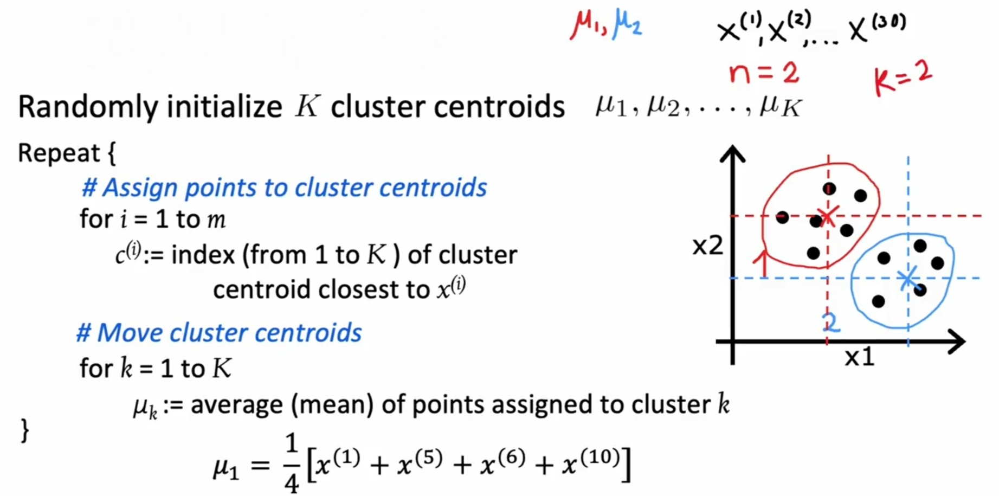

# K-Means

## Description

k-means clustering is a method of vector quantization, originally from signal processing, that aims to partition n observations into k clusters in which each observation belongs to the cluster with the nearest mean, serving as a prototype of the cluster.

<span dir="rtl">نحوه عملکرد کلیش این مدلیه که دو یا چند centroid اولیه (k عدد) رو تو نمودار انتخاب میکنه، فاصله تمامی نقاط موجود رو با تک تک این centroid ها اندازه میگیره و به هر کدوم که نزدیک تر بود به اون اختصاصش میده، حالا میانگین همه اونایی که به یه centroid اختصاص پیدا کردن رو میگیره و اون centroid رو به اون نقطه میانگین جا به جا میکنه، این کارو برای همه centroid ها تکرار میکنه، بعدش با توجه به موقعیت جدید centroid ها، دوباره نقاط رو اختصاص میده و الی آخر، انقدر این کارو تکرار میکنه تا دیگه centroid ها جا به جا نشن.</span>

## Formula



- <span dir="rtl">تو تصویر بالا میتونیم الگو ریاضیاتیشو ببینیم</span>
- <span dir="rtl">علامت m هم نشون میده چنتا نقطه داریم</span>
- <span dir="rtl">علامت k نشون دهنده تعداد centroid ها و کلاستر هاست</span>
- <span dir="rtl">علامت n نشون میده هر نقطه چه تعداد فیچر تو خودش داره، مثلا تو تصویر بالا چون نمودار دو بعدیه پس هر نقطه دوتا فیچر داره (n=2)</span>
- <span dir="rtl">علامت $\mu$ مشخصات موقعیت centroid ها هستن</span>
- <span dir="rtl">چون ممکنه این سیستم تو لوکال مینیموم هاش گیر کنه، یعنی یه حالت دسته بندی ای پیش بیاد که تعداد زیادی از نقاط به یه centroid وصلن اما یه تعداد کمی فقط به یه centroid دیگه رسیده، لازمه این الگوریتم رو بین 50 تا 1000 بار اجرا کنیم و آخر سر اونی که cost function با عدد کمتری داشت رو انتخاب کنیم</span>

## Best Number For The K

How should I know which number is the best for the K (number of clusters)?

We will select multiple numbers for it and each time we will check how the variation within each cluster changes.


Then by creating the below diagram we can easily find the best point (the best number for K).


Importantly, every time we increase the number of K, the variation in each cluster decreases, but it does not mean that we should continue this approach, each time we should check whether the reduction of variation was reasonable or just decreased a little.

## Example

```python
import matplotlib.pyplot as plt
from sklearn.preprocessing import StandardScaler

# Scale features
X_scaled = StandardScaler().fit_transform(X)

# Use elbow method to find optimal k
distortions = []
K_range = range(1, 10)
for k in K_range:
    kmeans = KMeans(n_clusters=k, random_state=42)
    kmeans.fit(X_scaled)
    print(f"Labels for k={k}: {kmeans.labels_}")
    distortions.append(kmeans.inertia_)

# Plot elbow curve
plt.plot(K_range, distortions)
plt.xlabel('k')
plt.ylabel('Distortion')
plt.title('Elbow Method For Optimal k')
```
