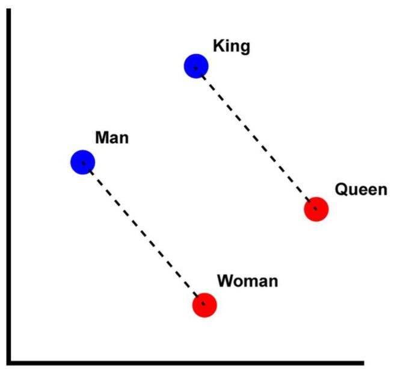
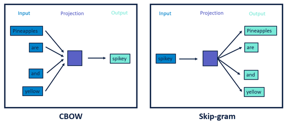

# Word2Vec [Self-Sup] {FastText}

## Description

Word2Vec a technique in natural language processing (NLP) for obtaining vector representations of words.
These vectors capture information about the meaning of the word based on the surrounding words.
The word2vec algorithm estimates these representations by modelling text in a large corpus.
Once trained, such a model can detect synonymous words or suggest additional words for a partial sentence.

Word2vec represents a word as a high-dimension vector of numbers which capture relationships between words.
In particular, words which appear in similar contexts are mapped to vectors which are nearby as measured by cosine similarity.
This indicates the level of semantic similarity between the words, so for example the vectors for walk and ran are nearby, as are those for but and however, and Berlin and Germany.

This means we can also perform vector arithmetic with the word vectors. For example:

Queen = King - Man + Woman



It does so in one of two ways, either using context to predict a target word (a method known as continuous bag of words, or **CBOW**), or using a word to predict a target context, which is called **skip-gram**.



## Varieties

=== "Standard"

    Standard Word2Vec model learns word representations based only on whole words, without considering subword information.
    It is effective for capturing semantic relationships between words that appear in similar contexts.

=== "FastText"

    FastText algorithm is similar to **Word2Vec**, but the biggest difference is that it also uses **N-grams** of words during training.
    While this increases the size and processing time of the model, it also gives the model the ability to predict different variations of words.

    For example, let's say that the word "Windows" is in the training dataset and we want to get the vector of the word "Wndows" after the training is finished.
    If the Word2Vec model is used for these operations, it will give an error that the word "Wndows" does not exist in the dictionary and will not return any vectors.
    However, if the FastText model is used for this process, both the vector will return and the word of "Windows" will be among the closest words.

    As explained above, not only the word itself but also N-gram variations are included in training (Example 3-gram expressions for the word "Windows" -> Win, ind, ndo, dow, ows).

    Although the FastText model is used in many different areas today, it is frequently preferred especially when word embedding techniques are needed in OCR works.
    Especially compared to other techniques that do not tolerate the slightest OCR error, FastText provides a great advantage in obtaining vectors of even words that are not directly in their vocabulary.
    For this reason, it is one step ahead of other alternatives in problems where word mistakes may occur.

## Example

=== "Standard"

    A Word2vec sample with a custom vocabulary:

    ```python
    import pandas as pd
    import numpy as np
    from urllib import request
    from gensim.models import Word2Vec

    # Get the playlist dataset file
    data = request.urlopen("https://storage.googleapis.com/maps-premium/dataset/yes_complete/train.txt")

    # Parse the playlist dataset file. Skip the first two lines as they only contain metadata
    lines = data.read().decode("utf-8").split("\n")[2:]

    # Remove playlists with only one song
    playlists = [s.rstrip().split() for s in lines if len(s.split()) > 1]

    # Load song metadata
    songs_file = request.urlopen("https://storage.googleapis.com/maps-premium/dataset/yes_complete/song_hash.txt")
    songs_file = songs_file.read().decode("utf-8").split("\n")
    songs = [s.rstrip().split("\t") for s in songs_file]
    songs_df = pd.DataFrame(data=songs, columns=["id", "title", "artist"])
    songs_df = songs_df.set_index("id")

    # Train our Word2Vec model
    model = Word2Vec(playlists, vector_size=32, window=20, negative=50, min_count=1, workers=4)

    def print_recommendations(song_id):
        similar_songs = np.array(model.wv.most_similar(positive=str(song_id), topn=5))[:, 0]
        return songs_df.iloc[similar_songs]

    # Extract recommendations
    print_recommendations(2172)
    ```
