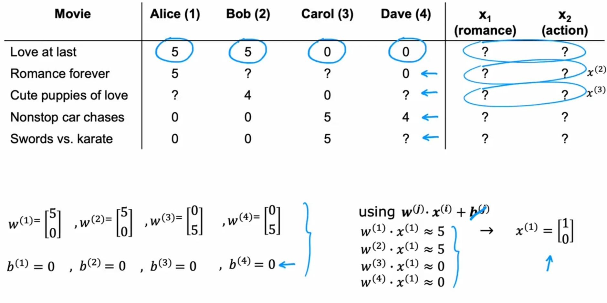
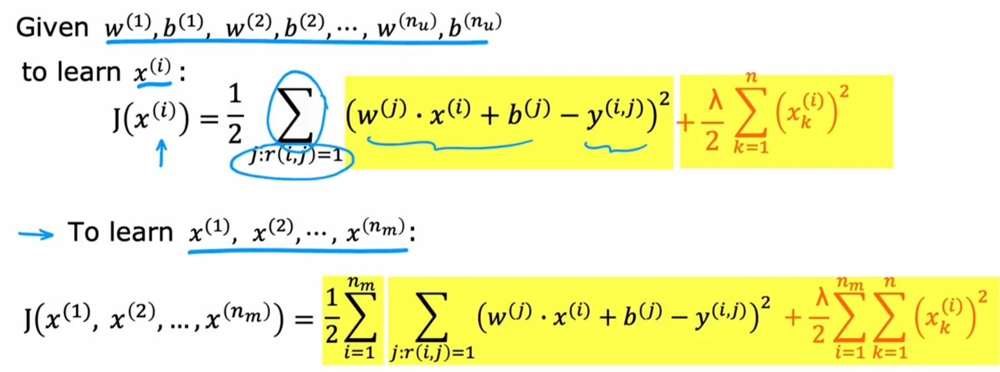
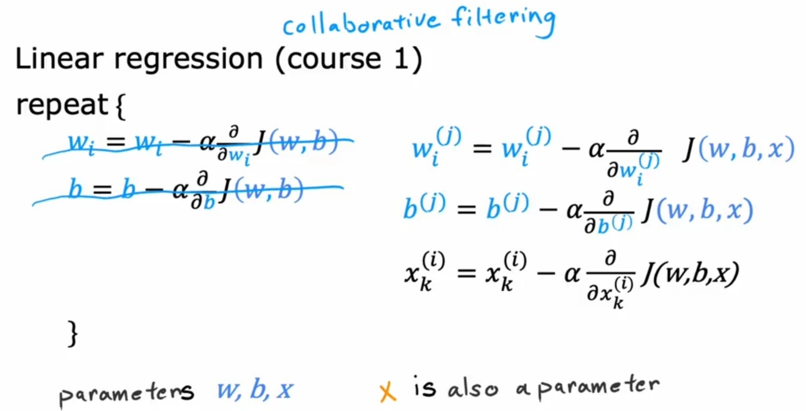
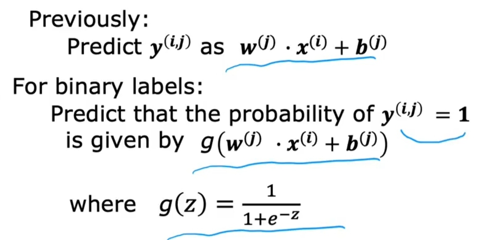
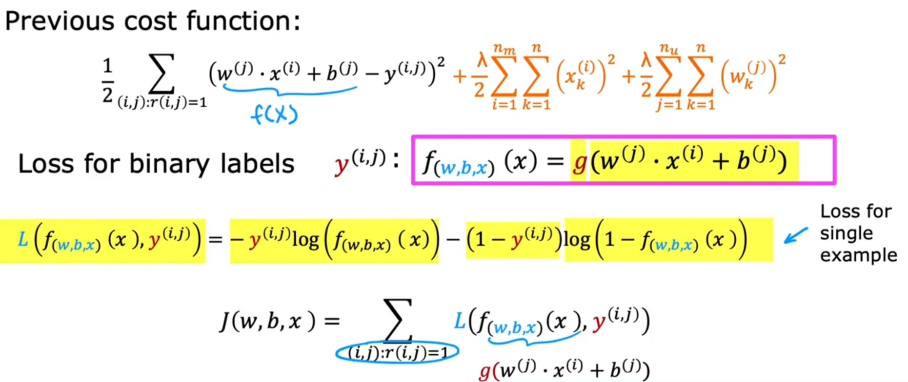
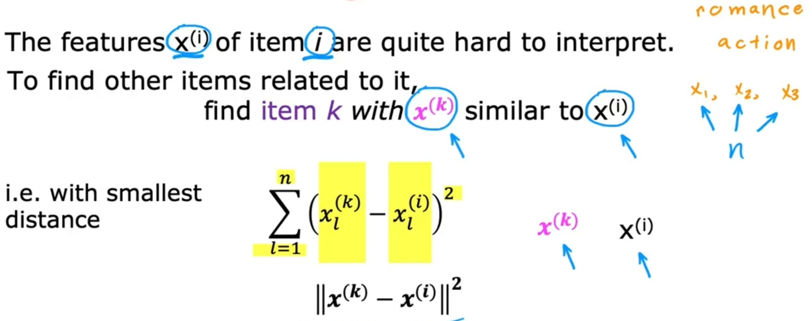

# Collaborative Filtering [Unsup]

## Description

- این الگوریتم دقیقا مشابه با Simple Recommendation هستش با این تفاوت که اینجا مقادیر x رو نداریم.
- این الگوریتم اصلی هستش و الگوریتم Simple Recommendation فقط برای فهم بهتر این الگوریتم مطرح شده
- از اونجایی که اساس این الگوریتم بر فعالیت کاربر تو سامانه هستش، همون ابتدا که کاربر هنوز هیچ فعالیت خاصی نداشته نمیتونه پیشنهادی هم بهش بده
- به طریق مشابه نکته قبل، اگر هنوز هیچ کاربری به یه محصول خاص واکنشی نشون نداده باشه، اون محصول قابلیت ارزیابی برای این الگوریتم نداره

## Formula

کاملا مشابه با Simple Recommendation هستش

## Specific Cost Function (Squared Error Loss)

Formula:

Gradient Descent:

همونطور که تو عکس پیداس، مشابه با Linear Regression هستش با این تفاوت که چون x هم اینجا جزو مجهولاته سه تا فانکشن داریم جای دوتا.

## Binary Classification

با استفاده از این شیوه خروجی این الگوریتم رو از حالت یک عدد، به حالت boolean تغییر میدیم (در اصل از حالت Linear regression به حالت Logistic regression تغییر میدیمش)

## Finding Related Items

بعد از این که مقادیر x برای هر محصول با استفاده از تکنیک های قبلی بدست اومد، به راحتی با چک کردن این x ها و پیدا کردن اون هایی که به هم نزدیک هستن (به وسیله فرمول تو تصویر) میتونیم یه سیستم ریکامندر داشته باشیم که مشابهت سنجی میکنه و پیشنهاد میده
