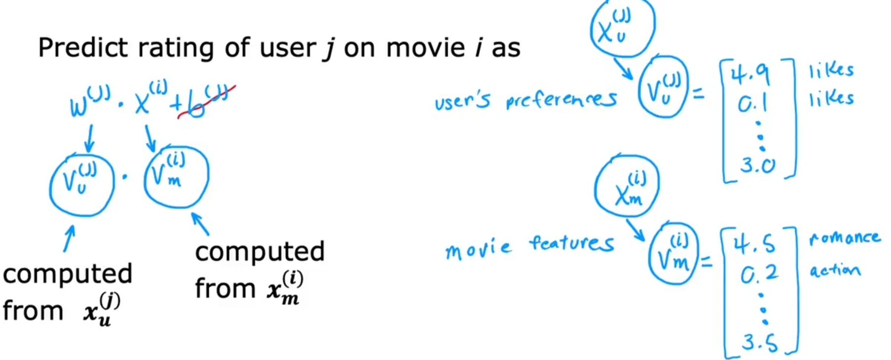
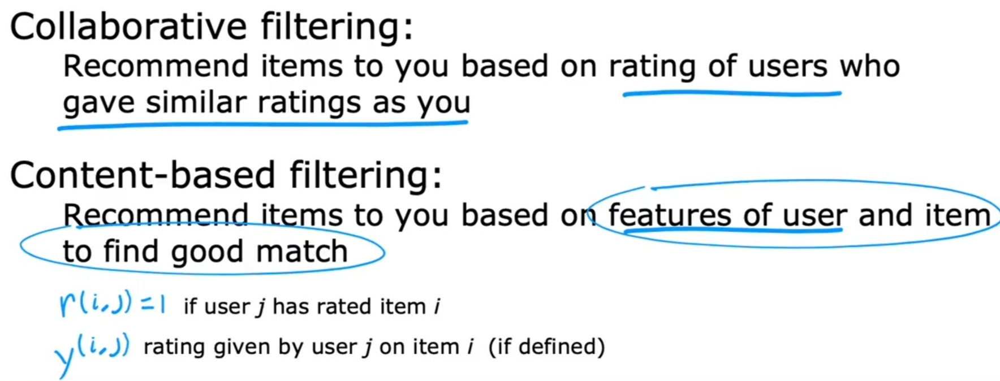

# Content-Based Filtering [Unsup]

## Description

## Specific Cost Function (Squared Error Loss)

## Collaborative vs Content-based Filtering

مهم ترین تفاوتشون اینه که تو اولی بسته به اینتراکشن کاربرها محصولات به هم وصل میشن و به کاربر ها ریکامند میشن، ولی تو دومی بسته به اطلاعات محصولات و کاربرا تصمیم گیری میشه که کدوم محصول به کدوم کاربر ریکامند بشه

## Finding Related Items

