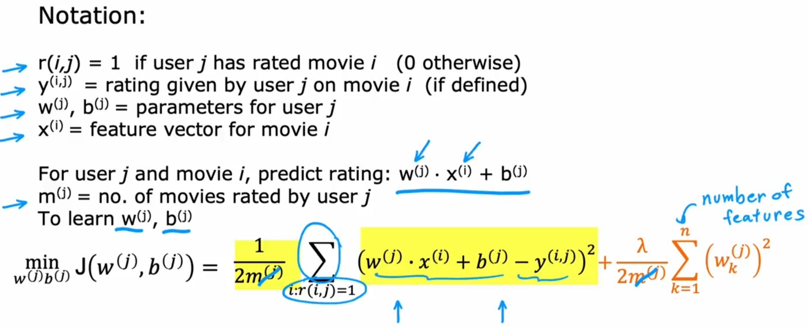

# Simple Recommendation [Unsup]

## Description

Recommendation engines are a subclass of machine learning which generally deal with ranking or rating products / users.
Loosely defined, a recommender system is a system which predicts ratings a user might give to a specific item.

- این یه الگوریتم واقعی نیستش، فقط برای فهم بهتر الگوریتم Collaborative Filtering مطرح شده

## Formula

دقیقا مشابه با Linear regression هستش با این تفاوت که برای هر کاربر سامانه یه فرمول جدا و مخصوص به خودش داریم، چون نمیشه یه شبکه عصبی درست کرد و برای همه استفاده کرد هرکس سلیقه خودشو داره.

## Specific Cost Function (Squared Error Loss)

چون چندین Linear regression داریم اینجا برای محاسبه Cost function مجموع تمامی (دوتا سیگما) رو در نظر میگیریم.
