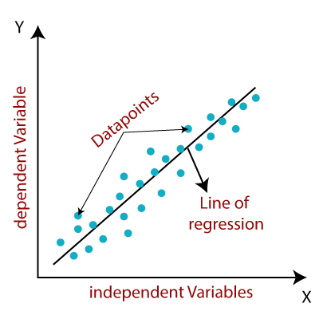
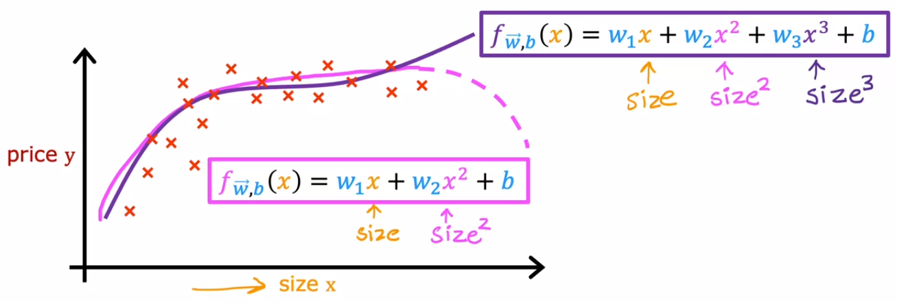

# Linear Regression [Sup] {Polynomial}

## Description

Linear regression is used to identify the relationship between a dependent variable and one or more independent variables and is typically leveraged to make predictions about future outcomes.
When there is only one independent variable and one dependent variable, it is known as simple linear regression.
As the number of independent variables increases, it is referred to as multiple linear regression.
For each type of linear regression, it seeks to plot a line of best fit, which is calculated through the method of least squares.
However, unlike other regression models, this line is straight when plotted on a graph.



## Varieties

=== "Standard"

    Standard Linear Regression models the relationship between variables as a straight line, using the least squares method to find the best fit.

=== "Polynomial"

    Polynomial Regression is a form of Linear regression known as a special case of Multiple linear regression which estimates the relationship as an nth degree polynomial.
    It is sensitive to outliers so the presence of one or two outliers can also badly affect the performance.

## Formula

=== "Standard"

    

    

=== "Polynomial"

    

## Example

=== "Standard (Scikit-Learn)"

    ```python
    from sklearn.datasets import load_diabetes
    from sklearn.linear_model import LinearRegression
    from sklearn.model_selection import train_test_split
    from sklearn.metrics import root_mean_squared_error

    X, y = load_diabetes(return_X_y=True)  # Load sample regression data
    X_train, X_test, y_train, y_test = train_test_split(X, y, test_size=0.3, random_state=42)

    model = LinearRegression()
    model.fit(X_train, y_train)

    y_pred = model.predict(X_test)
    print("RMSE:", root_mean_squared_error(y_test, y_pred))
    ```

=== "Standard (PyTorch - High-Level API)"

    ```python
    import torch
    import torch.nn as nn
    import torchmetrics
    from sklearn.datasets import load_diabetes
    from sklearn.model_selection import train_test_split

    # =========================
    # Init
    # =====
    torch.manual_seed(42)
    device = torch.device("cuda" if torch.cuda.is_available() else "cpu")

    # =========================
    # Load Data
    # =====
    X, y = load_diabetes(return_X_y=True)  # Load sample regression data
    X_train, X_test, y_train, y_test = train_test_split(X, y, test_size=0.3, random_state=42)

    X_train = torch.tensor(X_train, dtype=torch.float32).to(device)
    X_test = torch.tensor(X_test, dtype=torch.float32).to(device)
    y_train = torch.tensor(y_train, dtype=torch.float32).reshape(-1, 1).to(device)
    y_test = torch.tensor(y_test, dtype=torch.float32).reshape(-1, 1).to(device)

    # =========================
    # Model
    # =====
    n_features = X_train.shape[1]
    model = nn.Linear(in_features=n_features, out_features=1).to(device)

    # =========================
    # Training Loop
    # =====
    model.train()
    optimizer = torch.optim.AdamW(model.parameters(), lr=0.01)
    criterion = nn.MSELoss()
    n_epochs = 20

    for epoch in range(n_epochs):
        optimizer.zero_grad()
        y_pred = model(X_train)
        loss = criterion(y_pred, y_train)
        loss.backward()
        optimizer.step()

        print(f"Epoch {epoch + 1}/{n_epochs}, Loss: {loss.item()}")

    # =========================
    # Evaluation
    # =====
    model.eval()

    with torch.no_grad():
        y_pred = model(X_test)

    rmse_metric = torchmetrics.MeanSquaredError(squared=False).to(device)
    rmse = rmse_metric(y_pred, y_test)
    print(f"RMSE: {rmse.item():.4f}")
    ```

=== "Standard (PyTorch - Low-Level API)"

    ```python
    import torch
    import torchmetrics
    from sklearn.datasets import load_diabetes
    from sklearn.model_selection import train_test_split

    # =========================
    # Init
    # =====
    torch.manual_seed(42)

    # =========================
    # Load Data
    # =====
    X, y = load_diabetes(return_X_y=True)  # Load sample regression data
    X_train, X_test, y_train, y_test = train_test_split(X, y, test_size=0.3, random_state=42)

    X_train = torch.tensor(X_train, dtype=torch.float32)
    X_test = torch.tensor(X_test, dtype=torch.float32)
    y_train = torch.tensor(y_train, dtype=torch.float32).reshape(-1, 1)
    y_test = torch.tensor(y_test, dtype=torch.float32).reshape(-1, 1)

    # =========================
    # Model
    # =====
    n_features = X_train.shape[1]
    w = torch.randn((n_features, 1), requires_grad=True)
    b = torch.tensor(0., requires_grad=True)

    # =========================
    # Training Loop
    # =====
    learning_rate = 0.4
    n_epochs = 20

    for epoch in range(n_epochs):
        y_pred = X_train @ w + b
        loss = ((y_pred - y_train) ** 2).mean()
        loss.backward()

        with torch.no_grad():
            b -= learning_rate * b.grad
            w -= learning_rate * w.grad
            b.grad.zero_()
            w.grad.zero_()

        print(f"Epoch {epoch + 1}/{n_epochs}, Loss: {loss.item()}")

    # =========================
    # Evaluation
    # =====
    with torch.no_grad():
        y_pred = X_test @ w + b  # Use the trained parameters to make predictions

    rmse_metric = torchmetrics.MeanSquaredError(squared=False)
    rmse = rmse_metric(y_pred, y_test)
    print(f"RMSE: {rmse.item():.4f}")
    ```
