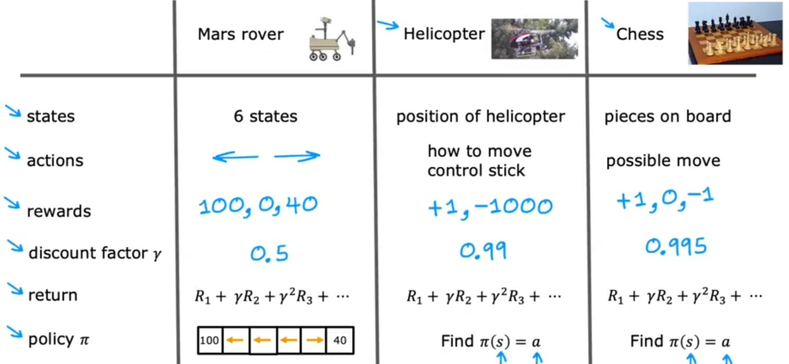
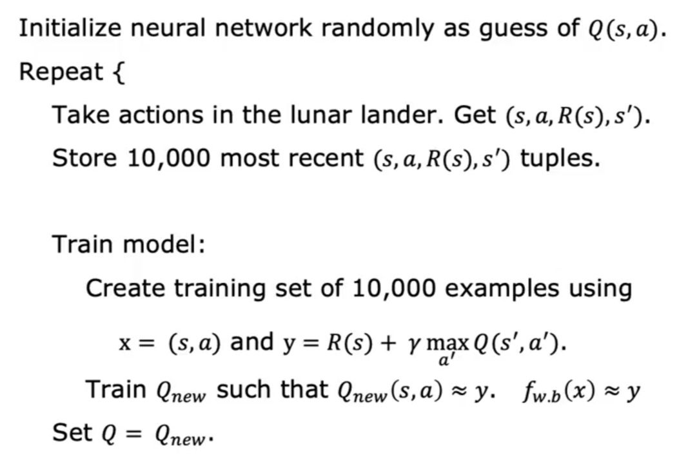

# Reinforcement Learning [Unsup]

## Description

تو این مدل از یادگیری چیزی تحت عنوان دیتای اولیه نداریم، در اصل یک سری شرایط تعریف میکنیم به اضافه فانکشن تصمیم گیری برای reward و بسته به حرکت به اون حرکت نمره میدیم.

- تعریف state: تمامی حالت هایی که ممکنه رخ بده
- تعریف action: تمامی تصمیماتی که میشه گرفت
- تعریف rewards: تمامی امتیازاتی که به یه حرکت میتونه تعلق بگیره
- تعریف discount factory: ضریبی که حتما کمتر از 1 هستش (البته نه خیلی زیاد، در حد یک دهم یا یک صدم)، این ضریب با قرار گرفتن کنار reward یه جورایی نقش زمان رو بازی میکنه، چون کمتر از یک هستش باعث میشه reward اون action کمتر بشه، یعنی هر چقدر دیرتر اون action خوب انجام بشه، از اونجایی که مرتب این عدد به توان میرسه، هی بیشتر و بیشتر reward اون action خوب رو کم میکنه
- تعریف return: فرمول محاسبه امتیاز action، در اصل discount factory تو این فرمول یکی یکی توانش زیاد میشه
- تعریف policy: ترجیح ما بر ارجحیت دادن کدام action

## Formula (Bellman Equation)

- با استفاده از این معادله reward حاصل از حرکت از یک state به یک state دیگه با استفاده از action خاص رو میشه محاسبه کرد.
- به بیان دیگه reward بر اساس این معادله به هر action اختصاص پیدا میکنه.
- چون تو این معادله، محاسبه reward هر action نیازمند داشتن reward حرکت های بعدیه، یه جورایی میشه بهش به شکل فانکشن recursive نگاه کرد.

## Random (Stochastic) Environment

بعضی اوقات سیستم اون مدلی که ما میخوایم عمل نمیکنه و ممکنه به هر علتی ربات تصمیم گرفته بره سمت چپ ولی پاش سر میخوره و میره سمت راست، حالا اتفاقای که میفته ممکنه کلا عوض بشه، مثلا ممکنه میخواسته به سمت 100 بره ولی کلا مسیر عوض بشه بره سمت 40 یا نه همون سمت 100 بره ولی با چند مرحله بیشتر از حالت عادی، تو این حالت برای محاسبه مقدار return از یک حالت استفاده نمیکینم، بلکه میانگین تمامی حالاتش رو حساب میکینم.

تو تصویر بالا حالت بروز شده فرمول Bellman Equation رو با در نظر گرفتن حالت میانگین میبینیم.
