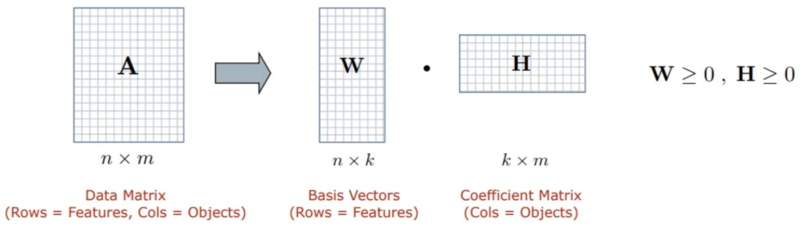
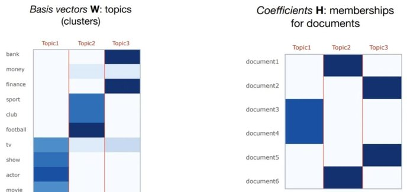

# NMF [Unsup]

## Description

Non-negative Matrix Factorization (NMF) is an unsupervised algorithm that simultaneously performs dimensionality reduction and clustering.

We can use it in conjunction with TF-IDF to model topics across documents.

## Workflow

Given a non-negative matrix A, find k-dimension approximation in terms of non-negative factors W and H

- Approximate each object (i.e.column of A) by a linear combination of k reduced dimensions or "basis vectors" in W
- Each basis vector can be interpreted as a cluster. The memberships of objects in these clusters encoded by H
- Input: Non-negative data matrix (A), number of basis vectors (k), initial values for factors W and H (e.g. random matrices)
- Objective Function: Some measure of reconstruction error between A and the approximation WH

  

- Expectation-maximization optimisation to refine W and H in order to minimise the objective function. Common approach is to iterate between two multiplicative update rules until convergence

  

- Basis vectors (k): the topics (clusters) in the data
- Coefficient matrix (H): the membership weights for documents relative to each topic (cluster)
- At the end we have each document assigned to a topic
- We also can search for the words that have the highest probability of being assigned to a topic
- For example, most common words (highest probability) for topic \#4 is: cat, vet, birds, dog ... food, home
- It is up to the user to interpret these topics and assign a meaningful name to them

## Example

Create a document term matrix with TF-IDF Vectorization:

Resulting W and H:

Just like LDA, we will need to select the number of expected topics beforehand (the value of k)!

Also just like with LDA, we will have to interpret the topics based on the coefficient values of the words per topic.
