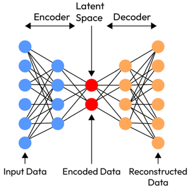
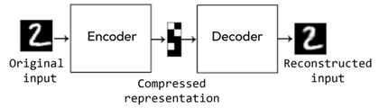

# Auto-Encoders (AE) [Dimensionality Reduction]

## Description

Another popular dimensionality reduction method that gives spectacular results is auto-encoders, a type of artificial neural network that aims to copy their inputs to their outputs.
They compress the input into a latent-space representation and then reconstruct the output from this representation.

An autoencoder is composed of two parts:

- Encoder: compresses the input into a latent-space representation.
- Decoder: reconstruct the input from the latent space representation.

