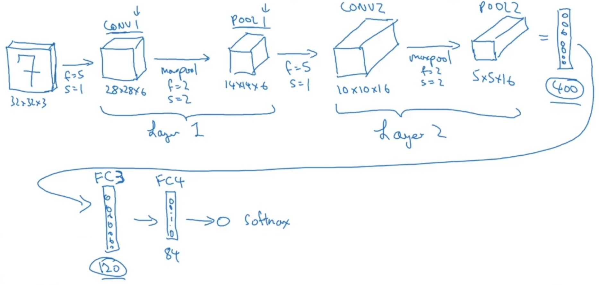
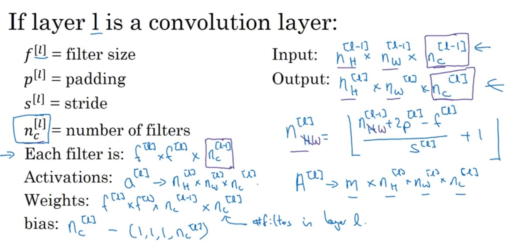

# Convolutional (CNN) [Image]

## Description

A convolutional neural network (CNN) is a regularized type of feed-forward neural network that learns feature engineering by itself via filter (or kernel) optimization.

- به شبکه عصبی ای که لایه هاش با تمام دیتای مرحله قبلی کاری نداشته باشن و فقط با یک بخشی ازش کار کنن گفته میشه
- تو این الگو لایه ها اصطلاحا fully-connected نیستن، یعنی هر unite به تمامی unite های لایه بعدی متصل نیست

A CNN is particularly well-suited to tasks involving spatial data, such as images.
Its architecture includes three main types of layers: convolutional layers, pooling layers, and fully connected layers.
The convolutional layers apply a series of filters to the input, which allows the network to automatically and adaptively learn spatial hierarchies of features.

Pooling layers decrease the spatial size of the representation, thereby reducing parameters and computation in the network to control overfitting and decrease the computation cost in the following layers.
Fully connected layers get the output of the pooling layer and conduct high-level reasoning on the output.

## Description in Details

تو این مدل شبکه عصبی با computer vision کار داریم و بناس با ماتریس های مربوط به تصاویر رنگی و سیاه سفید کار کنیم.

از اونجایی که تصاویر خیلی دیتا دارن و عملا امکان پذیر نیست همه unite ها به تمامی دیتای عکس دسترسی داشته باشن، از CNN برای train کردن استفاده میشه، مثلا تو تصویر زیر عددی که دایره سبز دورش هست فقط و فقط به وسیله اعداد داخل مربع سبز رنگ مشخص شده و هیچ کار دیگه ای با باقی پیکسل ها نداشته، همینطور عدد مشخص شده با دایره قرمز

برای کار با عکس، شبکه عصبی باید حداقل شامل مراحل زیر باشه:

- مرحله Convolution: تصویر اولیه به عنوان یه ماتریس به شبکه عصبی داده میشه با اعمال یک یا ده ها فیلتر یه ماتریس output ساخته میشه
- مرحله Polling: این مرحله هم مثل مرحله قبله ولی با این تفاوت که عملکرد فیلتر هاش متفاوته
- مرحله Fully connected: تو این مرحله سیستم از حالت Convolutional خارج میشه و لایه ها با هم fully connected میشن

## Convolution Step

توی تصویر بالا یه عکس 6 در 6 پیکسلی به دو فیلتر 3 در 3 داده شده و بعد از اعمال activation function روی پاسخ این تصویر 6 پیکسلی ما به تصویر 4 پیکسلی تغییر اندازه داده.

فرمول محاسبه اندازه نهایی تصویر بر اساس سایز اولیه تصویر و سایز فیلتر ها و … به شکل زیره:

تمامی پارامترهایی که یک لایه شبکه عصبی CNN ممکنه باهاش سروکار داشته باشه تو تصویر زیر اومده:

- پارامتر f: اندازه فیلتر رو مشخص میکنه، فیلتر ها همیشه اعداد مفرد هستن و معمولا هم 3 در 3 هستن
- پارامتر p: برای این که توی فرایند اعمال فیلترها روی تصویر، تصویر ما کوچیکتر نشه میتونیم قبل از دادن تصویر به فیلتر با استفاده از padding به اطراف تصویر فضا اضافه کنیم
- پارامتر s: گام های حرکت فیلتر روی تصویر رو مشخص میکنه، هرچقدر گام ها بلند تر، تصویر خروجی کوچیکتر
- پارامتر nc: تعداد فیلترهایی که میخوایم روی یک تصویر اعمال کنیم رو مشخص میکنه

## Polling Step

تو این مرحله، نتایج حاصل از مرحله Convolution را به یه فیلتر دیگر میدیم تا از هر چند پیکسل فقط یه پیکسل رو انتخاب کنه.

- پارامترهای این فیلتر f و s هستن که بالاتر بهش اشاره شد.
- توی شبکه عصبی CNN برای پارامتر های s و f تو این لایه اعداد ثابتی در نظر میگیرن و توی فرایند train این اعداد عوض نمیشن

Max polling:

محبوب ترین شیوه polling همین شیوه هستش که با حرکت بر اساس f و s تو هر رسید مربع بزرگترین پیکسل رو انتخاب میکنه

این فیلتر میتونه چند بعدی هم باشه

Average polling:

این شیوه هم دقیقا مثل max polling هستش با این تفاوت که میانگین پیکسل ها در نظر گرفته میشه و مثل max polling هم کاربردی نیست.
