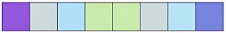
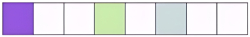
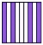
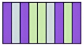
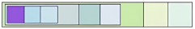
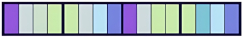

# Embedding [Dense] [Sparse] {NLP}

## Description

Embeddings are vector representations of discrete variables such as words, sentences, or items, commonly used in natural language processing (NLP) and neural networks.
They enable models to capture semantic relationships and similarities between entities by mapping them into continuous vector spaces.

## Varieties

### Dense

Dense embeddings use low-dimensional, continuous-valued vectors to represent entities.
Learned through neural networks (e.g., Word2Vec, GloVe), dense embeddings capture semantic relationships and are widely used in modern NLP applications.

!!! info

    Dense embeddings contain mostly non-zero values and are generated from machine learning models like Transformers.
    These vectors capture the semantic meaning of text and are used in semantic search.

### Sparse

Sparse embeddings represent entities using high-dimensional vectors where most elements are zero.
Traditional **one-hot encoding** and **bag-of-words models** are examples of sparse embeddings.
They are simple but can be memory-inefficient and do not capture semantic similarity.

!!! info

    Sparse vectors are often high-dimensional with many zero values.
    They are generated from algorithms like BM25 and SPLADE and are used in keyword-based search.

### Binary

Binary embeddings represent entities using vectors of binary values (0s and 1s).
These are useful for efficient storage and fast similarity computations, often used in large-scale retrieval systems.

!!! info

    Extreme quantization, reducing vector components to binary (0 or 1) values.
    Drastically reduces memory use.

### Quantized

Quantized embeddings reduce the precision of vector elements (e.g., from float32 to int8) to save memory and speed up computation.
Quantization is commonly applied to dense embeddings for deployment on resource-constrained devices.

!!! info

    Compressed dense vectors using lower-precision data types (e.g., float32 to int8).
    Reduces memory usage and speeds up search while maintaining most semantic information.

### Variable Dimension

Variable dimension embeddings allow different entities to have vectors of different lengths, adapting the representation size to the complexity or frequency of the entity.
This can improve efficiency and expressiveness in certain applications.

!!! info

    Flexible embedding sizes, like Matryoshka embeddings.
    Encode information hierarchically, allowing adaptation to different tasks or computational constraints while preserving semantic meaning.

### Multi-Vector

Multi-vector embeddings represent a single entity with multiple vectors, capturing different aspects or contexts.
This approach is used in advanced models to better encode polysemy or multi-faceted information.

!!! info

    Usage of multiple vectors instead of one pooled vector to represent e.g., token-wise embeddings (e.g., ColBERT).
    Allows for more detailed representation of complex texts.
