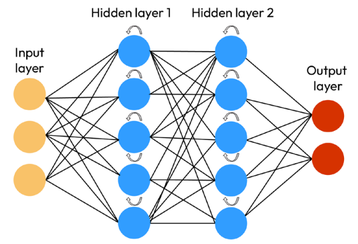
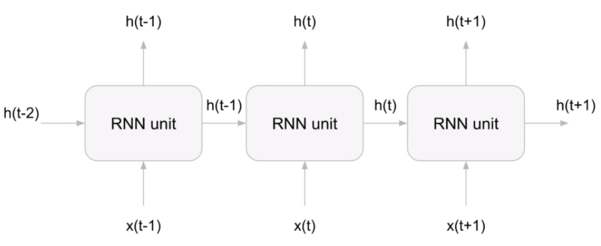

# Recurrent (RNN) * [Sequential Data]

## Description

Recurrent Neural Networks (RNNs) are a class of artificial neural networks uniquely designed to handle sequential data.

Unlike feedforward networks, RNNs have connections that form directed cycles.
This architecture allows them to use information from their previous outputs as inputs, making them ideal for tasks involving sequential data, such as time series prediction or NLP.

Examples of sequences:

- Time Series Data (Sales)
- Sentences
- Audio
- Car Trajectories
- Music

## Long Short-Term Memory (LSTM)

A significant variation of RNNs is the LSTM network, which uses special units in addition to standard units.
RNN units include a "memory cell" that can maintain information in memory for long periods, a feature that is particularly useful for tasks that require learning from long-distance dependencies in the data, such as handwriting or speech recognition.
