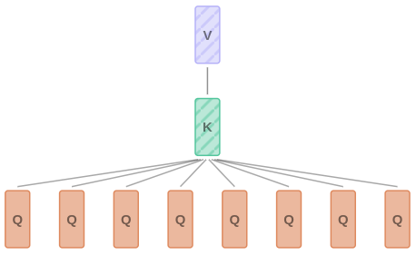
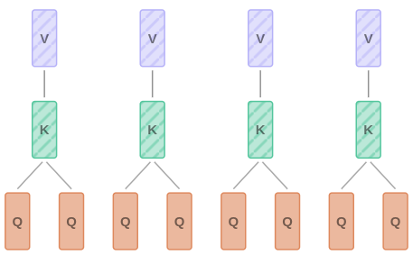
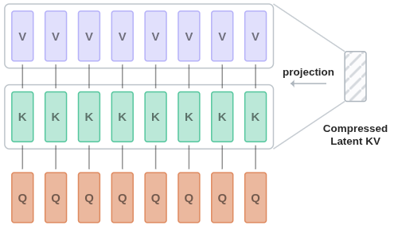

# Transformers * [NLP] {MoE} {MoR}

## Description

Transformers rely on a mechanism called self-attention, which allows the model to weigh the importance of different parts of the input data dynamically.
This enables efficient parallelization and handling of long-range dependencies more effectively than previous models, such as RNNs and LSTMs.


## Workflow

=== "Encoder Part"

    ```text
    Token Encodings = (One Hot Encodings . Token Embeddings) + Position Encodings

    Query = Token Encodings . Query Weights
    Key   = Token Encodings . Key Weights
    Value = Token Encodings . Value Weights

    Token Similarities    = Query . Key
    Self Attention Scores = Tokens Similarities . Value

    Encoder Part Output = Self Attention Scores + Token Encodings
    ```

=== "Decoder Part"

    ```text
    Token Encodings = (One Hot Encodings . Token Embeddings) + Position Encodings

    Query = Token Encodings . Query Weights
    Key   = Token Encodings . Key Weights
    Value = Token Encodings . Value Weights

    Token Similarities    = (Query . Key) + Next Tokens Mask
    Self Attention Scores = Tokens Similarities . Value

    Decoder Part Output = Self Attention Scores + Token Encodings
    ```

=== "Encoder-Decoder Part"

    ```text
    Query = Decoder Part Output . Query Weights
    Key   = Encoder Part Output . Key Weights
    Value = Encoder Part Output . Value Weights

    Token Similarities               = Query . Key
    Encoder-Decoder Attention Scores = Tokens Similarities . Value

    Encoder-Decoder Part Output = Encoder-Decoder Attention Scores + Decoder Part Output

    Fully Connected Layer Output = (Encoder-Decoder Part Output . Fully Connected Layer Weights) + Fully Connected Layer Bias
    Next Token Probabilities     = SoftMax(Fully Connected Layer Output)
    ```

## Varieties

=== "MoE"

    Mixture of Experts (MoE) is an advanced neural network architecture that increases model capacity and efficiency by routing inputs through a subset of specialized "expert" sub-networks.
    Unlike traditional dense models, MoE dynamically selects which experts to activate for each input, allowing for sparse computation and scalable training.

    - **Scalable and Efficient**: Enables training of extremely large models by activating only a fraction of the network per input, reducing computational cost while maintaining high capacity.
    - **Dynamic Routing**: Utilizes a gating mechanism to select the most relevant experts for each input, promoting specialization and diversity among experts.
    - **State-of-the-Art Performance**: Achieves strong results in language modeling and other tasks, especially in large-scale settings. MoE models have powered some of the largest and most capable language models to date.
    - **Flexible Design**: Can be integrated into various architectures, including Transformers, to enhance performance on tasks involving diverse or complex data distributions.

=== "MoR"

    Mixture of Recursion (MoR) is an emerging neural network architecture designed to enhance sequence modeling by leveraging recursive computation and dynamic routing.
    MoR architectures combine the strengths of recursive neural networks with the scalability of mixture models, enabling efficient handling of hierarchical and structured data.

    - **Recursive Computation**: Utilizes recursive structures to process sequences or trees, allowing the model to capture hierarchical relationships and compositional patterns in data.
    - **Dynamic Expert Selection**: Similar to Mixture of Experts, MoR employs a gating mechanism to dynamically select among multiple recursive modules (experts) for each input, promoting specialization and efficient computation.
    - **Efficient Hierarchical Modeling**: Excels at tasks requiring deep compositional reasoning, such as parsing, code analysis, and language understanding, by recursively combining information at multiple levels of abstraction.
    - **Scalable and Flexible**: Supports sparse activation and modular design, making it suitable for large-scale models and adaptable to various data modalities, including language, graphs, and structured documents.
    - **State-of-the-Art Potential**: MoR is a promising direction for advancing neural architectures in domains where recursive and hierarchical structures are fundamental.

=== "Decoder-Only"

    Generative Models (Decoder-Only) models are a class of transformer architectures designed primarily for generating sequential data.
    They are often referred to as **autoregressive models**, as they predict the next token in a sequence based on previous tokens.
    This makes them well-suited for tasks like text generation, language modeling, and code autocompletion.

    - One of the most popular examples of decoder-only models is **GPT (Generative Pre-trained Transformer)**, which has revolutionized the field of Natural Language Processing (NLP).
    - The **decoder-only architecture** is based on the transformer block but contains a few key differences compared to encoder-decoder or encoder-only models:
    - It **does not use an encoder**; instead, it processes input sequences directly in the decoder.
    - It utilizes **masked self-attention** to prevent the model from "seeing" future tokens during training. This ensures that predictions are made based solely on past information.
    - Decoder-only models predict one token at a time. For each step, they generate the next token in the sequence by conditioning on all previous tokens.
    - These models process information from left to right (in natural language). As a result, they are unable to consider future tokens during generation.

    Applications:

    - **Text Generation**: Produce coherent and contextually relevant text (e.g., ChatGPT).
    - **Dialogue Systems**: Power conversational agents like chatbots.
    - **Code Generation**: Support use cases like autocompletion for programming (e.g., OpenAI Codex).
    - **Creative Content**: Generate poems, stories, or other creative writing.
    - **Autoregressive Language Modeling**: Model language distributions effectively for downstream tasks.

=== "Encoder-Only"

    Representation Models (Encoder-Only) models are transformer architectures tailored for learning rich representations of input sequences.
    These models focus on understanding and encoding the input into highly contextualized embeddings, making them ideal for tasks that require comprehension but not generation.

    - One of the most well-known examples of encoder-only models is **BERT (Bidirectional Encoder Representations from Transformers)**, which introduced the concept of bidirectional contextual understanding to NLP.
    - The **encoder-only architecture** processes the entire input sequence at once using bidirectional self-attention. This allows the model to capture dependencies between tokens in both directions (left-to-right and right-to-left).
    - Encoder-only models consider the entire input simultaneously, leveraging left and right context for richer representations.
    - These models do not predict one token at a time but instead encode the whole sequence into meaningful vectors in one step.

    Applications:

    - **Text Classification**: Sentiment analysis, topic categorization, etc.
    - **Named Entity Recognition (NER)**: Identify entities like names, locations, and dates in text.
    - **Question Answering (QA)**: Extract answers from passages of text.
    - **Semantic Search**: Encode sentences to enable semantic similarity matching.
    - **Coreference Resolution**: Resolve pronouns to their corresponding entities in a document.

=== "Encoder-Decoder"

    Sequence-to-Sequence Models (Encoder-Decoder) models, also known as **sequence-to-sequence (seq2seq) architectures**, are a type of transformer designed for mapping one sequence to another.
    The architecture consists of two separate components: an **encoder** to process and understand the input sequence, and a **decoder** to generate the output sequence.

    - Examples of encoder-decoder-based transformers include **T5 (Text-to-Text Transfer Transformer)**, **BART (Bidirectional and Auto-Regressive Transformers)**, and **mT5 (multilingual T5)**.
    - The encoder-decoder architecture can be visualized as two connected transformers:

        - **Encoder**: Reads and processes the input sequence, generating a latent representation of the input.
        - **Decoder**: Consumes the encoder's latent representation while generating the output sequence autoregressively (one token at a time).

    - Uses bidirectional self-attention to produce contextualized representations of the input sequence.
    - Captures holistic meaning by attending to relations between tokens in the input.
    - Combines autoregressive decoding with encoder cross-attention to generate target tokens.
    - Uses both its own generated tokens (from self-attention) and the encoder's processed information (via encoder-decoder cross-attention).
    - Both encoder and decoder embed input tokens and enrich them with positional information.
    - The decoder uses cross-attention mechanisms to attend to the encoder's output representations, ensuring that the generated output remains aligned with the input sequence.

    Applications:

    - **Machine Translation**: Translate from one language to another.
    - **Text Summarization**: Generate concise summaries of long documents or articles.
    - **Text Generation with Context**: Generate output conditioned on input (e.g., rewriting text, question generation).
    - **Question Answering (QA)**: Provide a textual answer to a question given relevant contexts.
    - **Closed-Ended Transformation Tasks**:

        - Data-to-text generation (e.g., converting tables into sentences).
        - Grammar correction (e.g., fixing spelling and grammatical errors).
        - Format transformation (e.g., converting JSON to text).

## Components

### Attention

=== "Self-Attention"

    Self-Attention: The core mechanism that allows transformers to weigh the importance of different words in a sentence relative to each other.
    Each word attends to all other words in the sentence to gather context.

    Scaled Dot-Product Attention: This involves three matrices - Query (Q), Key (K), and Value (V).
    The attention scores are calculated as the dot product of the query and key vectors, scaled, and passed through a softmax function to get weights.
    These weights are then used to combine the value vectors.

=== "Multi-Head"

    

    Multi-Head Attention (MHA) instead of performing a single attention function, the model runs multiple attention mechanisms (heads) in parallel.
    Each head focuses on different parts of the sentence, capturing various aspects of the relationships between words.

    At inference time we don't need to recompute the KV values for past tokens and can reuse them.
    The memory for past KV values is called the **KV-Cache**.
    As context windows grow, this cache can quickly become an inference bottleneck and consume a large share of GPU memory.

    Here's a simple calculation to estimate the KV-Cache memory $s_{KV}$ for the Llama 3 architecture with MHA and a sequence length of 8192:

    $s_{KV} = 2 \times n_{\text{bytes}} \times seq \times n_{\text{layers}} \times n_{\text{heads}} \times dim_{\text{heads}}$

    $s_{KV} = 2 \times 2 \times 8192 \times 32 \times 32 \times 128 = 4\ \text{GB} \quad$ (Llama 3 8B)

    $s_{KV} = 2 \times 2 \times 8192 \times 80 \times 64 \times 128 = 20\ \text{GB} \quad$ (Llama 3 70B)

=== "Multi Query"

    

    Multi Query Attention (MQA) uses a single shared Key and Value for all query heads, significantly reducing KV-Cache memory requirements.
    This approach improves inference speed while maintaining competitive quality compared to Multi-Head Attention.

=== "Grouped Query"

    

    Grouped Query Attention (GQA) divides query heads into groups that share the same Key and Value, balancing the trade-off between MHA and MQA.
    It reduces KV-Cache memory and improves inference speed while maintaining better quality than MQA.

=== "Multihead Latent"

    

    Multihead Latent Attention (MLA) compresses Key and Value vectors into a shared latent space before computing attention, substantially reducing KV-Cache parameters.
    This approach achieves quality comparable to MHA while enabling more efficient inference at scale.

=== "Vs"

    | **Attention Mechanism**              | **KV-Cache parameters per token**                                                                           |
    | ------------------------------------ | ----------------------------------------------------------------------------------------------------------- |
    | **Multi-Head Attention (MHA)**       | $= 2 \times n_{\text{heads}} \times n_{\text{layers}} \times dim_{\text{head}}$                             |
    | **Multi Query Attention (MQA)**      | $= 2 \times 1 \times n_{\text{layers}} \times dim_{\text{head}}$                                            |
    | **Grouped Query Attention (GQA)**    | $= 2 \times g \times n_{\text{layers}} \times dim_{\text{head}} \quad \text{(typically } g = 2,4,8\text{)}$ |
    | **Multihead Latent Attention (MLA)** | $= 4.5 \times n_{\text{layers}} \times dim_{\text{head}}$                                                   |

### Other

=== "Feed-Forward NN"

    After the attention mechanism, the output is passed through a position-wise fully connected feed-forward network, which is the same for each position.

=== "Positional Encoding"

    Since transformers do not have a sequential nature like RNNs, they need some way to capture the order of words.
    Positional encodings are added to the input embeddings to give the model information about the position of each word in the sequence.

=== "Layer Normalization and Residual Connections"

    Each sub-layer (attention and feed-forward) is followed by a layer normalization and a residual connection to ensure stability during training.
