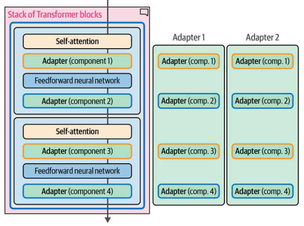

# Adapters [Sup] [PEFT]

## Description

!!! warning

    Adapter-based fine-tuning is largely outdated. Most modern workflows use LoRA or similar low-rank adaptation methods for better efficiency and scalability.

Adapters are a core component of many PEFT (Parameter-Efficient Fine-Tuning) based techniques.
The method proposes a set of additional modular components inside the Transformer that can be fine-tuned to improve the model's performance on a specific task without having to fine-tune all the model weights.
This saves a lot of time and compute.

!!! info

    Adapters that specialize in specific tasks can be swapped into the same architecture (if they share the same original model architecture and weights).

!!! info

    We can download specialized adapters from [adapterhub](https://adapterhub.ml/)
