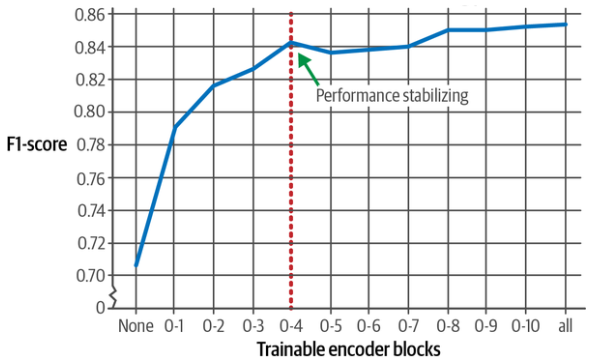

# Freezing Layers [Sup]

## Description

Researchers have shown that training only the first five encoder blocks is enough to almost reach the performance of training all encoder blocks.

Effect of frozen training blocks on training performance:



## Example

```python
model_id = "bert-base-cased"
model = AutoModelForSequenceClassification.from_pretrained(model_id, num_labels=2)

tokenizer = AutoTokenizer.from_pretrained(model_id)

# Encoder block 11 starts at index 165 and we freeze everything before that block
for index, (name, param) in enumerate(model.named_parameters()):
    if index < 165:
        param.requires_grad = False

trainer = Trainer(
    model=model,
    args=training_args,
    train_dataset=tokenized_train,
    eval_dataset=tokenized_test,
    tokenizer=tokenizer,
    data_collator=data_collator,
    compute_metrics=compute_metrics,
)
trainer.train()
```
