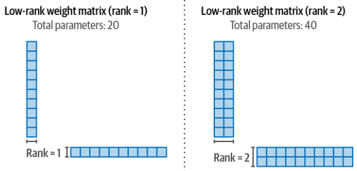
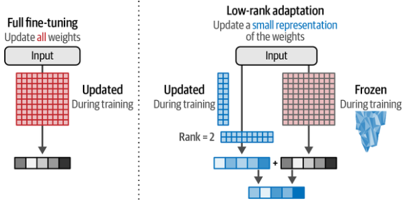

# LoRA [QLoRA] {PEFT}

## Description

As an alternative to adapters, low-rank adaptation (LoRA) was introduced and is a widely used and effective technique for PEFT (Parameter-Efficient Fine-Tuning). LoRA is a technique that (like adapters) only requires updating a small set of parameters. It creates a small subset of the base model to fine-tune instead of adding layers to the model.

Like adapters, this subset allows for much quicker fine-tuning since we only need to update a small part of the base model.

## Workflow

We create this subset of parameters by approximating large matrices that accompany the original LLM with smaller matrices. We can then use those smaller matrices as a replacement and fine-tune them instead of the original large matrices.

A major bottleneck of LLMs is their massive weight matrices. Only one of these may have 150 million parameters and each Transformer block would have its version of these.

Instead of 150 million parameters, let's reproduce the flow with a 10 times 10 matrix (100 parameters):

We can come up with two smaller matrices, which when multiplied, reconstruct a 10 times 10 matrix. This is a major efficiency win because instead of using 100 weights (10 times 10) we now only have 20 weights (10 plus 10).

During training, we only need to update these smaller matrices instead of the full weight changes. The updated change matrices (smaller matrices) are then combined with the full (frozen) weights.

## QLoRA

It combines low-rank adaptation (LoRA) with 4-bit quantization, allowing models to be fine-tuned on consumer hardware without sacrificing much performance. QLoRA reduces memory and computes requirements by freezing the base model, using low-rank adapters for updates, and storing the model in a compressed, quantized form.
