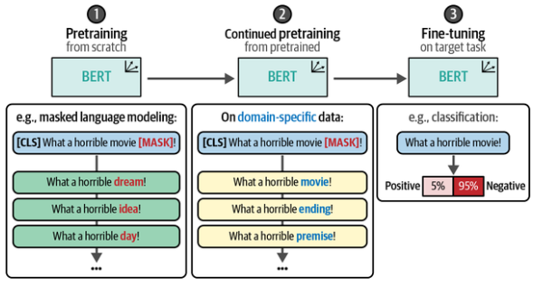

# Masked Language Modeling (MLM)

## Description

Instead of only fine-tuning a pre-trained model, we can prepend another step before fine-tuning, namely continue pretraining an already pre-trained BERT model. In other words, we can simply continue training the BERT model using masked language modeling (MLM) but instead use data from our domain. It is like going from a general BERT model to a BioBERT model specialized for the medical domain, to a fine-tuned BioBERT model to classify medication.

Instead of having to pretrain an entire model from scratch, we can simply continue pretraining before fine-tuning it for classification. This also helps the model to adapt to a certain domain or even the lingo of a specific organization.

!!! info

    Notice how the masks were filled with abstract concepts in 1 while they were filled with movie-specific concepts in 2.
