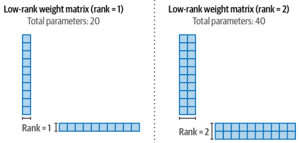
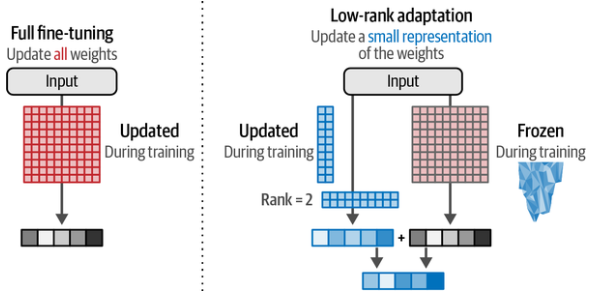

# PEFT [Sup] {Adapters} {LoRA}

## Description

=== "PEFT"

    Updating all parameters of a model has a large potential of increasing its performance but comes with several disadvantages.
    It is costly to train, has slow training times, and requires significant storage.
    To resolve these issues, attention has been given to **parameter-efficient fine-tuning (PEFT)** alternatives that focus on fine-tuning pretrained models at higher computational efficiency.

    !!! info

        Fine-tuning 3.6% of the parameters of BERT for a task can yield comparable performance to fine-tuning all the model's weights. On the GLUE benchmark, the authors show they reach within 0.4% of the performance of full fine-tuning.

=== "Adapters"

    !!! warning

        Adapter-based fine-tuning is largely outdated. Most modern workflows use LoRA or similar low-rank adaptation methods for better efficiency and scalability.

    Adapters are a core component of many PEFT (Parameter-Efficient Fine-Tuning) based techniques.
    The method proposes a set of additional modular components inside the Transformer that can be fine-tuned to improve the model's performance on a specific task without having to fine-tune all the model weights.
    This saves a lot of time and compute.

    

    !!! info

        Adapters that specialize in specific tasks can be swapped into the same architecture (if they share the same original model architecture and weights).

    

    !!! info

        We can download specialized adapters from [adapterhub](https://adapterhub.ml/)

=== "LoRA"

    As an alternative to adapters, low-rank adaptation (LoRA) was introduced and is a widely used and effective technique for PEFT (Parameter-Efficient Fine-Tuning).
    LoRA is a technique that (like adapters) only requires updating a small set of parameters.
    It creates a small subset of the base model to fine-tune instead of adding layers to the model.

    Like adapters, this subset allows for much quicker fine-tuning since we only need to update a small part of the base model.

    !!! info

        **QLoRA** combines low-rank adaptation (LoRA) with 4-bit quantization, allowing models to be fine-tuned on consumer hardware without sacrificing much performance.
        QLoRA reduces memory and computes requirements by freezing the base model, using low-rank adapters for updates, and storing the model in a compressed, quantized form.

## Workflow

=== "PEFT"

=== "Adapters"

=== "LoRA"

    We create this subset of parameters by approximating large matrices that accompany the original LLM with smaller matrices.
    We can then use those smaller matrices as a replacement and fine-tune them instead of the original large matrices.

    A major bottleneck of LLMs is their massive weight matrices.
    Only one of these may have 150 million parameters and each Transformer block would have its version of these.

    Instead of 150 million parameters, let's reproduce the flow with a 10 times 10 matrix (100 parameters):

    

    We can come up with two smaller matrices, which when multiplied, reconstruct a 10 times 10 matrix.
    This is a major efficiency win because instead of using 100 weights (10 times 10) we now only have 20 weights (10 plus 10).

    

    During training, we only need to update these smaller matrices instead of the full weight changes.
    The updated change matrices (smaller matrices) are then combined with the full (frozen) weights.

    
