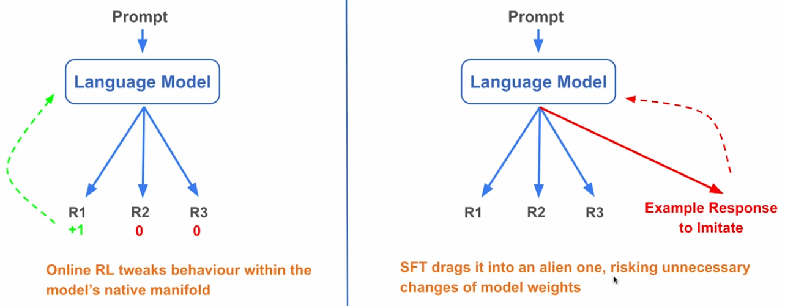

# Vs (SFT & DPO & RLHF & Online RL)

## Description

- **SFT**: Trains on labeled input-output pairs, but does not directly optimize for human preferences.
- **RLHF**: Uses a reward model and reinforcement learning to align with preferences, but is complex and unstable.
- **DPO**: Directly optimizes for preference pairs, offering a simpler and more robust alternative to RLHF.
- **Online RL**: Continuously updates the policy with new feedback during deployment, but is sample-inefficient and hard to control.

!!! info

    DPO is gaining popularity for instruction and alignment fine-tuning, especially when preference data is available.

## Overview

| Method                                             | Principle                                                                   | Pros                                                                                         | Cons                                                            |
| -------------------------------------------------- | --------------------------------------------------------------------------- | -------------------------------------------------------------------------------------------- | --------------------------------------------------------------- |
| **Supervised Fine-tuning (SFT)**                   | Imitate the example responses by maximizing the probability of the response | Simple implementation, great for jump-starting new model behavior.                           | May degrade performance on tasks not included in training data. |
| **Online Reinforcement Learning** (e.g. PPO, GRPO) | Maximize the reward for the response                                        | Better at improving model capabilities without degrading performance on unseen tasks.        | Complex to implement; needs well-designed reward functions.     |
| **Direct Preference Optimization (DPO)**           | Encourage good answers while discouraging bad ones                          | Contrastive training; effective at fixing bad behaviors and improving targeted capabilities. | Risk of overfitting; complexity between SFT & RL.               |

## Online RL's Advantage Over SFT

SFT learns from **static, external examples** curated by humans, while online RL generates its own training data from the model’s interactions. This makes online RL **self-driven, adaptive, and less likely to ruin other aspects of the model** since its examples come from the model itself.
