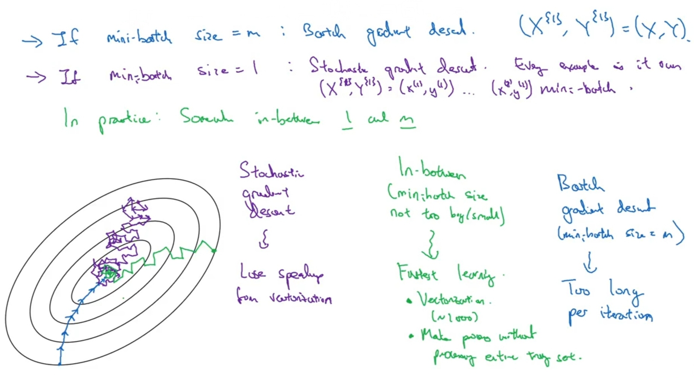

# Batch & Mini-batch

## Description

زمانی که تعداد دیتا هامون (m) خیلی زیاده بجای این که هر بار برای محاسبه j از کل دیتا های استفاده کنیم، میایم دیتا هارو به بخش های کوچکتر (mini-batch) تقسیم میکنیم و هر بار j رو بر اساس یکی از این بخش های کوچیک حساب میکنیم.

همینطور تو تصویر بالا میتونیم تاثیر این تغییر در نمودار j رو ببینیم، از اونجایی که تصمیم درباره مقدار بعدی w و b رو هر بار بر اساس یک تکه ای از دیتا (یعنی یک mini-batch) میگیریم، ممکنه در بعضی از مواقع نمودار j همواره نزولی نباشد، اما در کل نزولی خواهد بود.

تو تصویر بالا X که ماتریکسی از تمامی دیتاهای (m) ما هست رو به ماتریس های کوچکتر 1000 تایی شکستیم و هر کدوم از این mini-batch های 1000 تایی رو با نماد {i} نشون میدیم.

تو تصویر بالا:

- رنگ آبی به این اشاره داره که ما سایز های mini-batch هامون رو هم اندازه m بگیریم که در این صورت یک mini-batch بیشتر نخواهیم داشت که بهش در اصل Batch میگیم و خیلی سریعتر و دقیق تر به گلوبال مینیمم میرسه ولی یادمون نره که کلا هدف از استفاده ی mini-batch برای دیتا های خیلی زیاد هستش که عملا تو رم کامپیوتر جا نمیشن یا محاسباتشون خیلی طولانی میشه.
- رنگ بنفش به این اشاره داره که ما سایز های mini-batch هامون رو هم اندازه 1 بگیریم که در این صورت هر دونه از دیتا های ما در اصل یه mini-batch خواهد شد که در اصل بهش Stochastic و اصلا بهینه نیستش و عملا هیچوقت به گلوبال مینیمم نمیرسه، یه نکته دیگه که اینجا مهمه اینه که با این ویژگی جون به ازای هر دونه از دیتا هامون داریم j رو حساب میکنیم عملا نمیتونیم از خاصیت وکتوریزیشن استفاده کنیم و باید حلقه دستی بنویسیم.
- رنگ سبز به این اشاره داره که ما سایز های mini-batch هامون رو یه چیزی بین 1 و m بگیریم که در این صورت به هدفمون خواهیم رسید.

تو تصویر بالا هم میبینیم که:

- برای دیتا های زیر 2000 تا اصلا نیازی به استفاده از mini-batch نیست و خیلی راحت با همون تکنیک batch سریع و دقیق به هدفمون میرسیم.
- معمولا تعداد دیتا های داخل هر mini-batch رو مضربی از 2 قرار میدن
- برای انتخاب تعداد دیتا های داخل هر mini-batch حتما باید به منابع کامپیوتر توجه کنیم.

The batch size can significantly impact the learning process. Larger batch sizes result in faster progress in training but don't always converge as fast. Smaller batch sizes update the model frequently but the progress in training is slower.

Moreover, smaller batch sizes have a regularizing effect and can help the model generalize better, leading to better performance on unseen data. However, using a batch size that is too small can lead to unstable training, less accurate estimates of the gradient, and, ultimately, a model with worse performance.

## Stochastic Gradient Descent (SGD)

Uses a single example at each iteration of the optimizer. Therefore, the batch size for SGD is 1

تو تصویر بالا دو مفهوم Batch و Stochastic رو که تو عناوین قبلی اشاره شد میبینیم.
