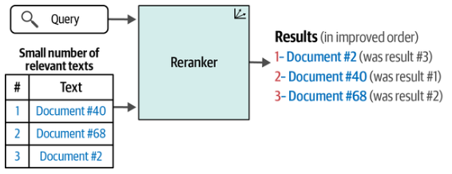

# Cross-Encoders (Reranking)

## Description

Search systems are often pipelines of multiple steps.
A reranking language model is one of these steps and is tasked with scoring the relevance of a subset of results against the query; the order of results is then changed based on these scores.

The following picture shows how rerankers are different from dense retrieval (bi-encoders) in that they take an additional input: a set of search results from a previous step in the search pipeline.

