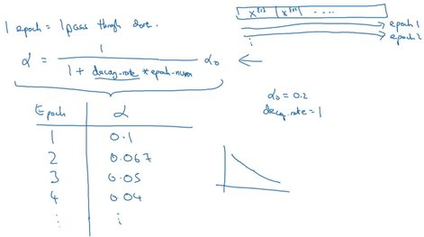

# Learning Rate Decay * {1cycle}

## Description

Learning Rate Decay helps gradually reduce the value of $\alpha$ so the model can move more smoothly and accurately toward the global minimum.



In the image above:

- Each epoch means one full pass over all the mini-batches.
- The decay rate is a number that indirectly controls how much $\alpha$ decreases in each epoch.

## Varieties

=== "Exponential Scheduling"

    With an Exponential Schedule, the learning rate is multiplied by a constant factor $\gamma$ at fixed intervals (usually every epoch).

    For instance, if $\gamma = 0.9$:

    - After 10 epochs the learning rate is about 35% of the initial value.
    - After 20 epochs, it is about 12%.

=== "Cosine Annealing"

    With Cosine Annealing, the learning rate follows a smooth cosine curve that gradually decreases from a maximum value to a minimum value over a fixed number of epochs (or steps).

    For instance:

    - At the halfway point ($t = T/2$), the learning rate is roughly half of the initial range.
    - Near the end ($t \approx T$), the learning rate becomes very small and approaches $\eta_{\min}$ smoothly, without sudden drops.

=== "Performance Scheduling"

    Performance Scheduling, also called Adaptive Scheduling, keeps track of a given metric during training—typically the validation loss—and if this metric stops improving for some time, it multiplies the learning rate by some factor.

=== "1cycle Scheduling *"

    1cycle Scheduling increases the learning rate from a lower starting value to a high maximum value during the first part of training, then decreases it back to a very small value during the second part.

    This schedule is designed to:

    - Help the model escape sharp or poor minima early (using a high LR),
    - Then converge smoothly at the end (using a very low LR).

    It typically follows three phases:

    1. **Warm-up:** $\eta$ increases linearly from $\eta_{\min}$ to $\eta_{\max}$ over the first half of the cycle.
    2. **Cool-down:** $\eta$ decreases linearly from $\eta_{\max}$ back to $\eta_{\min}$ over the second half.
    3. **Final Annealing:** A very short final phase where $\eta$ drops far below $\eta_{\min}$ to help the model settle.

## Formula

=== "Exponential Scheduling"

    $$
    \eta_{t} = \eta_{\max} \times \gamma^{t}
    $$

    - $\eta_{t}$: learning rate of the current epoch
    - $t$: the current epoch
    - $\eta_{\max}$: the maximum (initial) learning rate

    !!! info

        You usually choose $\gamma < 1$ but close to 1 so the learning rate decreases slowly.

=== "Cosine Annealing"

    $$
    \eta_{t} = \eta_{\min} + \frac{1}{2}(\eta_{\max} - \eta_{\min}) \left(1 + \cos\left(\frac{t \pi}{T_{\max}}\right)\right)
    $$

    - $\eta_{t}$: learning rate of the current epoch
    - $t$: the current epoch
    - $\eta_{\max}$: the maximum (initial) learning rate
    - $\eta_{\min}$: the minimum (final) learning rate
    - $T_{\max}$: the total number of epochs for one cosine cycle

    !!! info

        At the start ($t = 0$), the learning rate is at its maximum. As training progresses, the cosine function smoothly reduces the learning rate until it reaches $\eta_{\min}$ at $t = T$.

=== "Performance Scheduling"

    If metric does not improve for $\text{patience}$ epochs:

    $$
    \eta_{\text{new}} = \eta_{\text{old}} \times \text{factor}
    $$

    - $\eta_{\text{new}}$: the new learning rate
    - $\eta_{\text{old}}$: previous learning rate
    - $\text{factor}$: multiplier < 1 (e.g., 0.1)
    - $\text{patience}$: epochs without improvement

## Example

=== "Exponential Scheduling"

    ```python
    import torch.optim as optim

    model = ...
    optimizer = optim.AdamW(model.parameters(), lr=1e-3, weight_decay=0.01)
    scheduler = optim.lr_scheduler.ExponentialLR(optimizer, gamma=0.9)

    for epoch in range(n_epochs):
        for X_batch, y_batch in train_loader:
            ...  # The rest of the training loop

        scheduler.step()
    ```

=== "Cosine Annealing"

    ```python
    import torch.optim as optim

    model = ...
    optimizer = optim.AdamW(model.parameters(), lr=1e-3, weight_decay=0.01)
    scheduler = optim.lr_scheduler.CosineAnnealingLR(optimizer, T_max=20, eta_min=1e-3)

    for epoch in range(n_epochs):
        for X_batch, y_batch in train_loader:
            ...  # The rest of the training loop

        scheduler.step()
    ```

    !!! info

        Cosine annealing needs $T_{\max}$ and $\eta_{\min}$, and it's difficult to predict the right training length.
        So many people prefer performance–driven LR schedulers instead.

=== "Performance Scheduling"

    ```python
    import torch
    import torch.optim as optim
    import torchmetrics
    from torch.utils.data import DataLoader

    # =========================
    # Init
    # =====
    torch.manual_seed(42)
    device = torch.device("cuda" if torch.cuda.is_available() else "cpu")

    # =========================
    # Load Data
    # =====
    train_loader = DataLoader(...)
    valid_loader = DataLoader(...)

    # =========================
    # Model
    # =====
    model = ...

    # =========================
    # Evaluation Function
    # =====
    def evaluate_func(model, data_loader, metric):
        model.eval()
        metric.reset()  # Reset the metric at the beginning

        with torch.no_grad():
            for X_batch, y_batch in data_loader:
                X_batch = X_batch.to(device)
                y_batch = y_batch.to(device)

                y_pred = model(X_batch)
                metric.update(y_pred, y_batch)  # Update at each iteration

        return metric.compute()  # Compute the final result at the end

    # =========================
    # Training Loop
    # =====
    model.train()
    optimizer = optim.AdamW(model.parameters(), lr=1e-3, weight_decay=0.01)
    scheduler = optim.lr_scheduler.ReduceLROnPlateau(optimizer, mode="max", patience=2, factor=0.1)
    accuracy_metric = torchmetrics.Accuracy(task="multiclass", num_classes=10).to(device)
    n_epochs = 20

    for epoch in range(n_epochs):
        for X_batch, y_batch in train_loader:
            ...  # The rest of the training loop

        val_metric = evaluate_func(model, valid_loader, accuracy_metric).item()
        scheduler.step(val_metric)
    ```

    !!! info

        Hyperparameters:

        - `mode`: Use `max` when the metric should increase (e.g., accuracy); use `min` when it should decrease (e.g., loss).
        - `patience`: How many epochs to wait without improvement before lowering the learning rate.
        - `factor`: The multiplier applied to reduce the learning rate when no improvement is seen.

=== "1cycle Scheduling"

    ```python
    import torch.optim as optim

    model = ...
    optimizer = optim.AdamW(model.parameters(), lr=1e-3, weight_decay=0.01)
    n_epochs = 20
    scheduler = optim.lr_scheduler.OneCycleLR(
        optimizer,
        max_lr=0.01,
        epochs=n_epochs,
        steps_per_epoch=len(train_loader),
        pct_start=0.3,  # 30% of steps for warm-up
    )

    for epoch in range(n_epochs):
        for X_batch, y_batch in train_loader:
            ...  # The rest of the training loop
            scheduler.step()  # Note: 1cycle scheduling is usually applied per batch/step, not per epoch!
    ```

    !!! info

        Hyperparameters:

        - `max_lr`: The highest learning rate in the cycle.
        - `total_steps`: The total number of steps/iterations in the training run. This is crucial for defining the cycle length.
        - `pct_start`: The percentage of the total steps used for the warm-up phase (increasing $\eta$).
