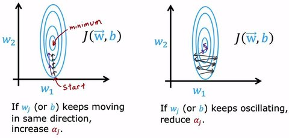

# Optimizers * {Adam} {AdamW} {SGD}

## Description

Optimizers use algorithms to determine whether each update is moving toward the minimum.



## Varieties

=== "Adam"

    Adam (Adaptive Moment Estimation) is a popular and powerful optimization algorithm used in machine learning (ML) and deep learning (DL).
    It is designed to efficiently find the optimal values for a model's parameters (its weights and biases) by iteratively updating them based on the training data.

    - If the step is going in the right direction, it increases the learning rate ($\alpha$) to move faster.
    - If the step is not going toward the minimum, it decreases the learning rate ($\alpha$) to slow down.

=== "AdamW"

    AdamW is an optimization algorithm that **builds upon the Adam** technique by **decoupling weight decay from the gradient update**.

    While Adam combines momentum and adaptive learning rates to efficiently move towards the minimum, AdamW improves generalization by applying weight decay directly to the parameters, rather than through the gradients.
    This adjustment helps prevent overfitting and leads to better performance in training deep neural networks.

=== "SGD"

    Stochastic Gradient Descent (SGD) updates model parameters by subtracting the loss gradient, calculated from random data samples.

=== "Gradient Descent With Momentum"

    <span dir="rtl">با استفاده از این تکنیک، بعد از محاسبه dw و db بجای استفاده مستقیم از اونا، اول توی فرمول exponential weighted moving average قرار میدیم و نتیجه حاصل رو برای محاسبه w و b بعدی استفاده میکنیم، با این کار عملا سرعت یادگیری رو بالا تر میبریم و زودتر به گلوبال مینیمم میرسیم، البته باید توجه کنیم که مقدار β رو ما خودمون باید به شکل تجربی بسته به شرایط انتخاب کنیم.</span>

=== "ADOPT"

    ADOPT offers a better alternative for optimizing Deep Learning models and LLMs.
    The key issue with Adam was the lack of convergence guarantee during weight updates, which is addressed by ADOPT.
    This isn't just theoretical—ADOPT has been shown to outperform Adam in most tasks, including GPT-2 pretraining.

    The core idea and solution to ensure convergence are:

    1. Removing the current gradient from the second momentum estimate.
    2. Normalizing the gradient before updating the momentum.

=== "Lookahead"

    The lookahead optimizer is an innovative optimization technique that enhances the training stability and convergence of traditional optimizers, such as Adam or SGD, by maintaining two sets of parameters:

    - **Fast weights**: Are updated frequently using a standard optimizer
    - **Slow weights**: Are updated less frequently by synchronizing them with the fast weights

    This approach allows for better exploration of the loss landscape, as the optimizer can escape local minima and smooth out oscillations in the optimization trajectory.

    !!! info

        By leveraging the strengths of both the base optimizer and the lookahead mechanism, this optimizer leads to faster convergence and improved generalization, making it a valuable addition to deep learning model training.

## Formula

=== "Adam"

    Initialize: $V_{dw} = 0$, $S_{dw} = 0$, $V_{db} = 0$, $S_{db} = 0$

    On iteration $t$: Compute $dW$, $db$ using the current mini-batch.

    $V_{dw} = \beta_1 V_{dw} + (1 - \beta_1) dW$, $V_{db} = \beta_1 V_{db} + (1 - \beta_1) db$ <-- "momentum" $\beta_1$

    $S_{dw} = \beta_2 S_{dw} + (1 - \beta_2) dW^2$, $S_{db} = \beta_2 S_{db} + (1 - \beta_2) db^2$ <-- "RMSprop" $\beta_2$

    $V_{dw}^{\text{corrected}} = V_{dw} / (1 - \beta_1^t)$, $V_{db}^{\text{corrected}} = V_{db} / (1 - \beta_1^t)$

    $S_{dw}^{\text{corrected}} = S_{dw} / (1 - \beta_2^t)$, $S_{db}^{\text{corrected}} = S_{db} / (1 - \beta_2^t)$

    $W := W - \alpha \frac{V_{dw}^{\text{corrected}}}{\sqrt{S_{dw}^{\text{corrected}}} + \epsilon}$, $b := b - \alpha \frac{V_{db}^{\text{corrected}}}{\sqrt{S_{db}^{\text{corrected}}} + \epsilon}$

    !!! info

        It basically combines the ideas of **Gradient Descent with Momentum** and **RMSProp** into one technique.

=== "SGD"

    On iteration $t$: Compute $dW$, $db$ using current example.

    $W := W - \alpha \, dW$

    $b := b - \alpha \, db$

=== "Gradient Descent With Momentum"

    Compute $dW, db$

    $v_{dw} = \beta v_{dw} + (1 - \beta)dW$

    $v_{db} = \beta v_{db} + (1 - \beta)db$

    $W = W - \alpha v_{dw}, b = b - \alpha v_{db}$

    $\beta = 0.9$

## Example

=== "Adam"

    ```python
    from torch.optim import Adam

    optimizer = Adam(model.parameters(), lr=1e-3)
    ```

=== "AdamW"

    ```python
    from torch.optim import AdamW

    optimizer = AdamW(model.parameters(), lr=1e-3, weight_decay=0.01)
    ```

    !!! info

        The `weight_decay` parameter controls the strength of L2 regularization (Ridge).

=== "SGD"

    ```python
    from torch.optim import SGD

    optimizer = SGD(model.parameters(), lr=1e-3)
    ```

=== "ADOPT"

    ```python
    from adopt import ADOPT

    optimizer = ADOPT(model.parameters(), lr=1e-3)
    ```

=== "Lookahead"

    ```python
    import torch

    class Lookahead(torch.optim.Optimizer):
        def __init__(self, optimizer, k=5, alpha=0.5):
            self.optimizer = optimizer
            self.k = k
            self.alpha = alpha
            self.step_counter = 0
            self.slow_weights = [
                [p.clone().detach() for p in group["params"]]
                for group in optimizer.param_groups
            ]

        def step(self):
            self.step_counter += 1
            self.optimizer.step()

            if self.step_counter % self.k == 0:
                for group, slow_weights in zip(self.optimizer.param_groups, self.slow_weights):
                    for p, q in zip(group["params"], slow_weights):
                        # q = slow weights, p = fast weights
                        p.data.mul_(self.alpha).add_(q, alpha=1.0 - self.alpha)
                        q.data.copy_(p.data)
    ```
