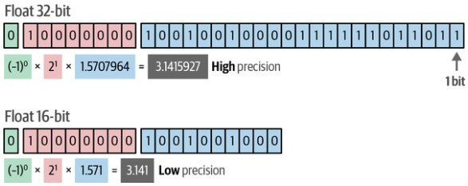

# Quantization

## Description

The weights of an LLM are numeric values with a given precision, which can be expressed by the number of bits like float64 or float32.
If we lower the amount of bits to represent a value, we get a less accurate result.
However, if we lower the number of bits we also lower the memory requirements of that model.



!!! info

    Notice the lowered accuracy when we halve the number of bits.

## Example

```python
import torch
import torch.quantization as quant

model = ...  # Pre-trained model
quantized_model = quant.quantize_dynamic(model, {torch.nn.Linear}, dtype=torch.qint8)
```
