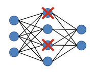

# Dropout *

## Description

Dropout is a powerful regularization technique that randomly "drops out" a portion of neurons during training.



It helps combat overfitting by randomly deactivating a fraction of neurons during each training iteration, **forcing the network to develop redundant pathways for information flow**.
This technique **prevents neurons from becoming overly dependent** on each other by creating a form of ensemble learning within a single network, where different subnetworks handle similar tasks.
The result is a more robust model that relies on distributed representations rather than memorizing specific patterns, ultimately improving generalization to unseen data when all neurons are active during inference.

## Varieties

=== "Standard"

    Standard dropout randomly disables a fraction of neurons during each training step, reducing co-adaptation and helping the model generalize better to unseen data.

=== "Adaptive"

    Adaptive dropout starts with a higher dropout rate and **gradually decreases it** over the course of fine-tuning.
    This allows the model to adapt to the new task while still maintaining some regularization to prevent overfitting.

    !!! info

        This approach prevents overfitting more efficiently than standard dropout, as it maintains the network's capacity to learn complex patterns through important neurons while aggressively regularizing redundant or noise-sensitive parts, resulting in models that generalize better with less performance sacrifice on critical features.

=== "Layer-Wise"

    Layer-wise adaptive regularization involves **applying different regularization strengths to different layers** of the model.

    This can be particularly effective for LLMs, where lower layers may benefit from less regularization to capture fundamental patterns, while higher layers might need stronger regularization to prevent overfitting.

## Example

=== "Standard"

    ```python
    import torch
    import torch.nn as nn

    class SimpleTransformer(nn.Module):
        def __init__(self, vocab_size, d_model, nhead, num_layers, dropout=0.1, max_len=1000):
            super().__init__()
            self.embedding = nn.Embedding(vocab_size, d_model)
            self.pos_embedding = nn.Embedding(max_len, d_model)
            encoder_layer = nn.TransformerEncoderLayer(d_model, nhead, 4*d_model, dropout)
            self.transformer = nn.TransformerEncoder(encoder_layer, num_layers)
            self.fc_out = nn.Linear(d_model, vocab_size)
            self.dropout = nn.Dropout(dropout)

        def forward(self, x):
            seq_len = x.size(1)
            pos = torch.arange(seq_len, device=x.device)
            x = self.embedding(x) + self.pos_embedding(pos)
            x = self.dropout(x)
            x = self.transformer(x.transpose(0, 1)).transpose(0, 1)
            return self.fc_out(x)
    ```

    !!! info

        In this implementation, dropout is applied after the embedding layer and within each transformer layer.

=== "Adaptive"

    ```python
    import torch.nn as nn
    from torch.optim import AdamW
    from transformers import GPT2LMHeadModel, GPT2Tokenizer

    def fine_tune(model_id, dataloader, initial_dropout=0.1, epochs=3):
        model = GPT2LMHeadModel.from_pretrained(model_id)
        tokenizer = GPT2Tokenizer.from_pretrained(model_id)
        optimizer = AdamW(model.parameters(), lr=5e-5, weight_decay=0.01)

        for epoch in range(epochs):
            model.train()
            total_loss = 0
            current_dropout = initial_dropout * (1 - epoch / epochs)

            # Update dropout rates
            for module in model.modules():
                if isinstance(module, nn.Dropout):
                    module.p = current_dropout

            # Training loop
            for batch in dataloader:
                optimizer.zero_grad()
                outputs = model(**batch)
                loss = outputs.loss
                loss.backward()
                optimizer.step()
                total_loss += loss.item()

            print(
                f"Epoch {epoch + 1}, "
                f"Loss: {total_loss / len(dataloader):.4f}, "
                f"Dropout: {current_dropout:.4f}"
            )
    ```

=== "Layer-Wise"

    ```python
    import torch.nn as nn

    class LayerwiseAdaptiveRegularization(nn.Module):
        def __init__(self, base_model, base_dropout=0.1, dropout_step=0.02):
            super().__init__()
            self.base_model = base_model
            for i, layer in enumerate(base_model.transformer.h):
                dropout = base_dropout + i * dropout_step
                layer.attn.dropout.p = dropout
                layer.mlp.dropout.p = dropout

        def forward(self, *args, **kwargs):
            return self.base_model(*args, **kwargs)

    base_model = create_lm_model()
    model = LayerwiseAdaptiveRegularization(base_model)
    ```
