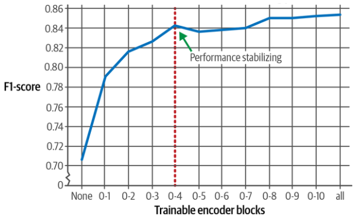

# Freezing Layers

## Description

Researchers have shown that training only the first five encoder blocks is enough to almost reach the performance of training all encoder blocks.

Effect of frozen training blocks on training performance:



## Example

=== "Standard"

    ```python
    def freeze_layers(model_to_freeze, *, num_layers_to_freeze):
        for param in model_to_freeze.base_model.parameters():
            param.requires_grad = False  # First freeze all layers

        for i, layer in enumerate(model_to_freeze.base_model.transformer.h):
            if i >= len(model_to_freeze.base_model.transformer.h) - num_layers_to_freeze:
                for param in layer.parameters():
                    param.requires_grad = True  # Then unfreeze some of them

    model_id = "bert-base-cased"
    model = AutoModelForSequenceClassification.from_pretrained(model_id, num_labels=2)
    freeze_layers(model, num_layers_to_freeze=4)
    ```

=== "Adaptive"

    With a function like this, we can start training and gradually unfreeze some layers:

    ```python
    def gradual_unfreeze(model, trainer, num_epochs, total_layers):
        layers_per_epoch = total_layers // num_epochs

        for epoch in range(num_epochs):
            freeze_layers(model, (epoch + 1) * layers_per_epoch)
            trainer.train(resume_from_checkpoint=True)
    ```
