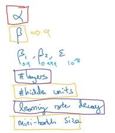

# Hyperparameter Tuning

## Description

در تصویر زیر Hyperparameter های مرسوم رو میبینیم که با توجه لیست زیر درصد اهمیت هر کدوم برامون بیشتر مشخص میشه و میدونیم که برای کدوم بیشتر وقت بذاریم و برای کدوم کمتر.

- رنگ قرمز از همه مهمتر
- رنگ زرد اولویت دوم
- رنگ بنفش اولویت سوم
- بی رنگ ها (پارامتر های تکنیک آدام) هم از اعداد دیفالت استفاده شود
