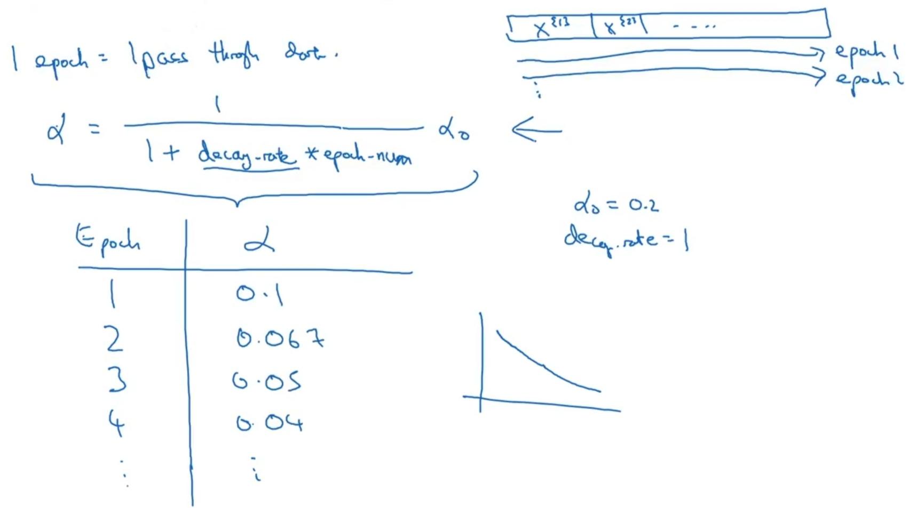

# Learning Rate Decay (lrDecay)

## Description

این تکنیک کمک میکنه رفته رفته مقدار α کم بشه تا دقیق تر و بدون پرش بتونه به گلوبال مینیمم برسه.

تو تصویر بالا:

- هر epoch به معنی یه دور کامل عبور از تمامی mini-batch هاس
- مقدار decay-rate عددی هستش که به شکل غیر مستقیم مشخص میکنه تو هر epoch چقدر از مقدار α کم بشه
