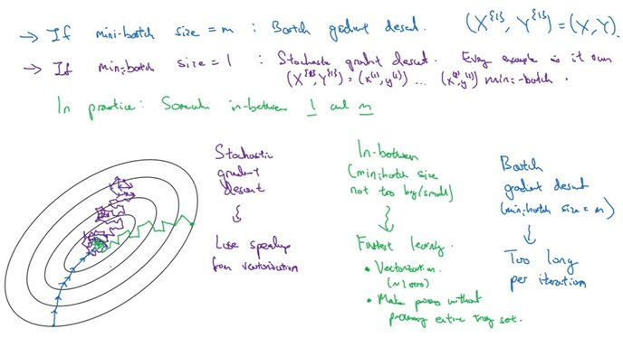

# Stochastic Gradient Descent (SGD) {Mini-Batch}

## Description

Uses part of examples at each iteration of the optimizer. Therefore, the batch size for SGD is $n$


!!! info

    The batch size can significantly impact the learning process.
    Larger batch sizes result in faster progress in training but don't always converge as fast.
    Smaller batch sizes update the model frequently but the progress in training is slower.

    Moreover, smaller batch sizes have a regularizing effect and can help the model generalize better, leading to better performance on unseen data.
    However, using a batch size that is too small can lead to unstable training, less accurate estimates of the gradient, and, ultimately, a model with worse performance.

## Workflow

<span dir="rtl">زمانی که تعداد دیتا هامون (m) خیلی زیاده بجای این که هر بار برای محاسبه j از کل دیتا های استفاده کنیم، میایم دیتا هارو به بخش های کوچکتر (mini-batch) تقسیم میکنیم و هر بار j رو بر اساس یکی از این بخش های کوچیک حساب میکنیم.</span>


<span dir="rtl">همینطور تو تصویر بالا میتونیم تاثیر این تغییر در نمودار j رو ببینیم، از اونجایی که تصمیم درباره مقدار بعدی w و b رو هر بار بر اساس یک تکه ای از دیتا (یعنی یک mini-batch) میگیریم، ممکنه در بعضی از مواقع نمودار j همواره نزولی نباشد، اما در کل نزولی خواهد بود.</span>


<span dir="rtl">تو تصویر بالا X که ماتریکسی از تمامی دیتاهای (m) ما هست رو به ماتریس های کوچکتر 1000 تایی شکستیم و هر کدوم از این mini-batch های 1000 تایی رو با نماد {i} نشون میدیم.</span>



<span dir="rtl">تو تصویر بالا:</span>

- <span dir="rtl">رنگ آبی به این اشاره داره که ما سایز های mini-batch هامون رو هم اندازه m بگیریم که در این صورت یک mini-batch بیشتر نخواهیم داشت که بهش در اصل Batch میگیم و خیلی سریعتر و دقیق تر به گلوبال مینیمم میرسه ولی یادمون نره که کلا هدف از استفاده ی mini-batch برای دیتا های خیلی زیاد هستش که عملا تو رم کامپیوتر جا نمیشن یا محاسباتشون خیلی طولانی میشه.</span>
- <span dir="rtl">رنگ بنفش به این اشاره داره که ما سایز های mini-batch هامون رو هم اندازه 1 بگیریم که در این صورت هر دونه از دیتا های ما در اصل یه mini-batch خواهد شد که در اصل بهش Stochastic و اصلا بهینه نیستش و عملا هیچوقت به گلوبال مینیمم نمیرسه، یه نکته دیگه که اینجا مهمه اینه که با این ویژگی جون به ازای هر دونه از دیتا هامون داریم j رو حساب میکنیم عملا نمیتونیم از خاصیت وکتوریزیشن استفاده کنیم و باید حلقه دستی بنویسیم.</span>
- <span dir="rtl">رنگ سبز به این اشاره داره که ما سایز های mini-batch هامون رو یه چیزی بین 1 و m بگیریم که در این صورت به هدفمون خواهیم رسید.</span>


<span dir="rtl">تو تصویر بالا هم میبینیم که:</span>

- <span dir="rtl">برای دیتا های زیر 2000 تا اصلا نیازی به استفاده از mini-batch نیست و خیلی راحت با همون تکنیک batch سریع و دقیق به هدفمون میرسیم.</span>
- <span dir="rtl">معمولا تعداد دیتا های داخل هر mini-batch رو مضربی از 2 قرار میدن</span>
- <span dir="rtl">برای انتخاب تعداد دیتا های داخل هر mini-batch حتما باید به منابع کامپیوتر توجه کنیم.</span>

## Example

```python
import torch
import torch.nn as nn
from torch.utils.data import TensorDataset, DataLoader
from sklearn.datasets import load_diabetes
from sklearn.model_selection import train_test_split
from sklearn.metrics import root_mean_squared_error

# =========================
# Init
# =====
torch.manual_seed(42)
device = torch.device("cuda" if torch.cuda.is_available() else "cpu")

# =========================
# Load Data
# =====
X, y = load_diabetes(return_X_y=True)  # Load sample regression data
X_train, X_test, y_train, y_test = train_test_split(X, y, test_size=0.3, random_state=42)

X_train = torch.tensor(X_train, dtype=torch.float32)
X_test = torch.tensor(X_test, dtype=torch.float32)
y_train = torch.tensor(y_train, dtype=torch.float32).reshape(-1, 1)
y_test = torch.tensor(y_test, dtype=torch.float32).reshape(-1, 1)

train_dataset = TensorDataset(X_train, y_train)
train_loader = DataLoader(train_dataset, batch_size=32, shuffle=True)

# =========================
# Model
# =====
model = nn.Sequential([...]).to(device)  # Define the model

# =========================
# Training Loop
# =====
model.train()
optimizer = torch.optim.AdamW(model.parameters(), lr=0.01)
criterion = nn.MSELoss()
n_epochs = 20

for epoch in range(n_epochs):
    total_loss = 0.0

    for X_batch, y_batch in train_loader:
        X_batch, y_batch = X_batch.to(device), y_batch.to(device)

        optimizer.zero_grad()
        y_pred = model(X_batch)
        loss = criterion(y_pred, y_batch)
        loss.backward()
        optimizer.step()

        total_loss += loss.item()

    mean_loss = total_loss / len(train_loader)
    print(f"Epoch {epoch + 1}/{n_epochs}, Loss: {mean_loss:.4f}")

# =========================
# Evaluation
# =====
model.eval()
X_test = X_test.to(device)

with torch.no_grad():
    y_pred = model(X_test)

print("RMSE:", root_mean_squared_error(y_test.numpy(), y_pred.cpu().numpy()))
```

!!! info

    For better GPU memory efficiency and pinned memory optimization, it's recommended to move each batch to the device during training.
